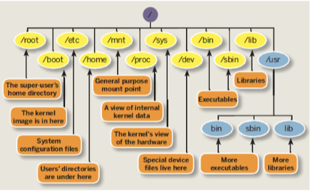

## Intro

Learning outcomes of week 1:

- [Aims of computer security](#information-security-aims)
- [Understanding potential vulnerabilities](#information-security-potential-attackers)

---

**Do not try out anything on computers you do not own!!!**

- **It is illegal to access computers without the owner's permission.**
- **Most access are logged, and it is easy to get caught.**
- **Trying things "just for fun" could be punishable offense.**

## Learning Outcome

- Understand basic concepts of cryptography and SQL.
- Understand basic concepts of cloud services, in particular storage.
- Demonstrate an understanding of the threats to data stored on a computer, locally or in the cloud.
- Demonstrate an understanding of the threats to data sent on the network.
- Identify risks and use techniques to eliminate or mitigate them.

## Module Outline

- Cryptography
- Access Control
- Introduction to Networking
- Security Protocols
- Web Systems and Attacks
- Other Common Attacks and Defenses

## What is Computer Security

- Correctness and Efficient algorithms against an attacker.
- Information and Infrastructure
  - Sensitive data
  - Control systems
  - Hardware devices

- How to safeguard?
  - Set security goal
  - Estimate impact of attacks
  - Design mitigations
- Analyse systems, spot vulnerabilities, build protection.

## Information Security: Aims

- **Confidentiality**: attacker should not retrieve any information
- **Integrity and Authenticity**: Receive data is authentic and the sender is genuine.
- **Availability**: Data should accessible on demand.

## Information Security: Potential Attackers

Could be anyone and Everyone.

- **Hackers**: Potentially learning by running known attacks, exploiting vulnerabilities.
- **Criminals**: Take control of computers via bugs in software. Phishing attacks, Denial of Service.
- **Governments**: Extreme computing powers, control on resources.
- **Business Houses like ISPs**: Spying to sell your data.

## Some Known Attacks

- Ransomware
- Phishing

## Unix Commands and Shell Scripts

### Why do we need these?

- **Shell commands**: operations on files.
- **Utilising OS commands**: potentially faster.
- **Batch Processing**: Sequentially running programs.

### Linux filesystem

### Shell Commands

- Structure: *command-name option input----output*
- `echo`, `mkdir`, `ls`, `pwd`, `cat`, `cp`, `mv`, `rmdir`, `rm`, `touch`, `locate`, `find`, `grep`, `diff`, `du`, `head`, `diff`, `tar`, `top`, `history`, etc.

---

Here are some exercises, try them!

1. Make 400 directories with names student1, student2, ... student400.
2. Create a directory in the parent folder.
3. Create a blank pdf file with 10 pages.