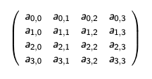

## 1. Cryptography

- Cryptography describes how to transfer messages between participants without anyone else being able to read or modify them.
- Prerequisite for Computer Security.
- Before we start with Cryptography, we need to look at how to represent data.

## 2. Codes vs. Ciphers

A **code** is any way to represent data, it will use bit strings (sequence of bits) to represent data.

- i.e. Morse Code, ASCII, Hex, Base64

A **cipher** is a code where it is difficult to derive data from code.

- Always uses a key.
- Data for a cipher usually called *plain text*, encoding called *cipher text*.
- **Encryption**: plain text --> cipher text
- **Decryption**: cipher text --> plain text


**Question** What is "27" encoded in binary?

| Binary              | Base          |
| ------------------- | ------------- |
| 0001 1011           | 27 as decimal |
| 0010 0111           | 27 as hex     |
| 110110 111011       | 27 as Base64  |
| 0011 0010 0011 0111 | 27 as ASCII   |

**Hex**

* Characters 0 to F encode 4 bits
* Easiest way to write down binary as text

**ASCII**

[ASCII table official website](https://www.asciitable.com/)

**Base64**

- Shortest way to write binary as printable characters
- Common for keys and crypto
- This module will use Hex

### 2.1 Caesar Cipher

CC replaces each letter of the alphbet with one three to the right, i.e.

- a --> d
- b --> e
- z --> c

### 2.2 Using a Key

These ciphers are easy to break because as soon as you know the scheme you can decrypt the message.

**Kerckhoffs's principle**: A cipher should be secure even if the attackers knows everything about it apart from the key.

- i.e. Caesar cipher using n rotations.

- But only 26 possible keys so you can just try them all (w/o key is 26 times harder than w/ it).

- Better scheme replaces each letter with another letter (26! ~= 4 * 10^26 possible keys).

### 2.3 Frequency Analysis

Frequency analysis counts the number of times

- each symbol occurs
- each pair of symbols

...and tries to draw conclusions from this.


## 3. Symmetric Cryptography

- Proper encryption schemes
- Assumption: All participants share common secret key (problematic!)
- Most important encryption scheme and possible attacks against them
- Modular arithmetic

### 3.1 Modular Arithmetic

Arithmetic modulo *n* means that you count up to n-1 then look back to 0.

*a mod b = r* for largest whole number *k* such that *a = b \* k + r*

i.e. *9 mod 4 = 1* because 9 = 2 * 4 + 1

### 3.2 XOR

| A    | B    | A xor B |
| ---- | ---- | ------- |
| 0    | 0    | 0       |
| 1    | 0    | 1       |
| 0    | 1    | 1       |
| 1    | 1    | 0       |

Important properties:

- *xor* is associative and commutative
- for all bitstrings *M*, *M xor 0 = M*
- for all bitrings *M*, *M xor M = 0*

### 3.3 One time Pads 一次性密码本

Needs a key as long as the message.

XOR / add the key and the message: Demo here with strings and addition and subtraction of keys; for bitstrings use xor.

**Example 1: Encryption**

Message: HELLOALICE

Key: THFLQRZFJK

Cipher text: ALRWERKNLO

```text
HELLOALICE -> 7 4 11 11 14 0 11 8 2 4
//Now generate key
THFLQRZFJK -> 19 7 5 11 16 17 25 5 9 10
//Add them individually with mod 26 then convert to letters
0 11 17 22 4 17 10 13 11 14 -> ALRWERKNLO
```

**Example 2: Decryption**

Cipher text: ALRWERKNLO

Key: UXDTDXFHXN

Plain text: GOODBYEBOB

```text
ALRWERKNLO -> 0 11 17 22 4 17 10 13 11 14 
//Get the key
UXDTDXFHXN -> 20 23 3 19 3 23 5 7 23 13 
//Subtract them individually with mod 26 then convert to letters
6 14 14 3 1 24 4 1 14 1 -> GOODBYEBOB
```

> Theorm
>
> Given any ciphertext of a certain length, without knowing the key the probability of the ciphertext being the encryption of a plaintext of the same length is the same for all plaintexts of the same length as the ciphertext.
>
> 密文由等长明文加密的概率 = 密文与明文等长的概率

**Problem**

- The key needs to be as long as the message
- Must use key only once

### 3.4 Block Ciphers 分组密码

They are made up of a series of permutations and substitutions repeated on each block.

The key controls the exact nature of the permutations and substitutions

### 3.5.1 Advanced Encryption Standard (AES)

> AES加密是一种对称加密方法，也就是说加密和解密是用同一个密钥。
>
> RSA加密则是非对称加密，使用公钥进行加密，并使用私钥进行解密。

- It worked on blocks of 128-bits
- It generates 10 round keys from a single 128-bit key
- It uses one permutation *ShiftRows* and three substitutions *SubBytes, MixColumns, AddRoundKey*. 

> AES encryption with a particular key maps any 128-bit block to a 128-bit block (or 256)
>
> AES decryption also maps any 128-bit block to a 128-bit block.
>
> Decryption can be run on any block (not just encryptions).

A block of **128 bits** is represented by a 4x4-matrix where each element is a byte (8 bits)



#### 3.5.1 SubBytes: S-box

*SubByte* is an operation on bytes using finite field arithmetic


#### 3.5.2 ShiftRows

*ShiftRows* moves the

- 2nd row one byte to the left
- the 3rd row two bytes
- the 4th row three bytes


#### 3.5.3 MixColumn

*MixColumn* is a substitution of each column such that:


#### 3.5.4 AddRoundKey

*AddRoundKey* applies *xor* to the block and the 128-bit round key (which was generated from the main key).


#### 3.5.5 Security of AES

1. No formal proof of security (P = NP?).
2. There are side channel attacks (i.e. via measuring power consumption, execution time)
3. Key aspects of security:
   - Shuffling of rows and columns to ensure small change in input causes very big change in output.
   - Require at least one non-linear operation (in the sense of linear algebra) on the data - provided by the *SubByte*-operation.

### 3.6 Data Encryption Standard (DES)

- It was the previous standard
- Before it was accepted as a standard the NSA stepped in and added S-boxes and fixed the key length at 56 bits.

- S-boxes are a type of substitution.

#### 3.6.1 3-DES

Triple DES, was a stop gap until AES, it takes three keys, k<sub>1</sub>, k<sub>2</sub>, and k<sub>3</sub>.

- E<sub>k1</sub>, <sub>k2</sub>, <sub>k3</sub> (M) = E<sub>k3</sub> (D<sub>k2</sub> (E<sub>k1</sub> (M)))

If 3-DES having k1 = k2 = k3 then it is equivalent to DES.

> 在3-DES中，Dk_2指使用了和第一和第三阶段不同密钥的第二解密阶段。

### 3.7 Padding

- Block ciphers only work on fixed size blocks.
- If the message isn't of the right block size we need to pad the message.
- But receiver needs to tell the difference between the padding and message.

---

**Q1** Add random bytes to the end of the block? No.

**Q2** Add zeros to the end of the block? No.

**Q3** Write "this is padding" ? No.

#### PKCS 5/7

PKCS#5 and PKCS#7 are ways for padding.

- If there is 1 byte of space write 01
- If there are 2 byte of space write 0202
- If there are 3 byte of space write 030303
- If the message goes to the end of the block add a new block of 161616...

> PKCS#7 用于16byte的区块，PKCS#5 用于8byte的区块。

### 3.8 Block Cipher Modes

> 分块加密模式，需要结合上面的AES理解。下面的加密模式中（除了ECB），都需要一个Key和一个IV。IV用于增加随机性，Key用于真正的加密。而使用的Key的加密环节很有可能就是AES加密（包括substitution和permutation等方法）。

1. **Electronic codebook mode** (ECB) 电码本 对图像加密效果较弱

   - Each block is encrypted individually, encrypted blocks are assembled in the same order as the plain text blocks.
   - If blocks are repeated in the plain text, this is revealed by the cipher text.

   > ECB加密模式会把同一个Key重复地用于所有分块的加密，如果同一文件的两个分块的明文完全一样，那么加密出来的密文也完全一样。

2. **Cipher Block chaining Mode** (CBC) 加密块链 对图像加密效果较好

   - each block XOR'd with previous block
   - Start with a random *Initialization Vector (IV)*
   - Suppose plain text is B1, B2, ... , Bn.
     - IV = random number
     - C1 = encrypt(B1 XOR IV)
     - C2 = encrypt(B2 XOR C1)
     - Cn = encrypt(Bn XOR Cn-1)

3. **CBC decrypt **解密时使用key从C1开始XOR

   - Receive IV

   - Receive cipher text C1, C2, ... , Cn

     B1 = decrypt(C1) XOR IV

     B2 = decrypt(C2) XOR C1

     Bn = decrypt(Cn) XOR Cn-1

4. **Counter Mode** (CTR) 对VI而不是明文进行加密

   - Plain text: B1, B2, ... , Bn

   - IV: random number

     C1 = B1 XOR encrypt(IV)

     C2 = B2 XOR encrypt(IV+1)

     Cn = Bn XOR encrypt(IV + n - 1)

> 为什么我们每次都随机生成IV，但是仍然需要Key来对数据进行加密？不是多此一举吗？
>
> 并不是这样，IV虽然每次都是随机的，但是它是随着密文一起发送的，它的目的是为信息增加随机性，而不是真的为信息进行加密。Plaintext（A）先与IV（B）异或，得出中间值（C），然后再使用Key来对中间值（C）进行<u>加密</u>。这个Key是只有交流双方知道的，只有这样才能完全保证安全性。而上面提到的Key加密，本质上是使用Key为输入的一系列数学运算，包括substitution和permutation等等。

### 3.9 Probabilistic Encryption

- Probabilistic encryption schemes use random elements to make every encryption different.
- CBC with a random IV is a good way to make encryption probabilistic.
- Using CBC and random IVs let me encrypt the same same, and with the same key, without an attacker realising.

> 为加密增加概率，不确定性。尽管你在使用对称加密时，每次都是用相同的密钥，但是只要你使用了不同的IV，就可以有效增加随机性，攻击者很可能意识不到这一点。

### 3.10 Known Plain Text Attacks

If I know the plain text I can change CTR encrypted messages

i.e. If I know *Enc<sub>CTR</sub>(M1)* and I know M1, I can make a cipher text that decrypts to any message I want, for example M2.

New cipher text is ***Enc<sub>CTR</sub>(M1) ⨁ (M1 ⨁ M2)***

Decryption:

**Dec<sub>CTR</sub>(Enc<sub>CTR</sub>(M1) ⨁ (M1 ⨁ M2))** =

**Dec<sub>CTR</sub>(Enc(N || Ctr) ⨁ M1) ⨁ (M1 ⨁ M2)** =

**Enc(N || Ctr) ⨁ (Enc(N || Ctr) ⨁ M1) ⨁ (M1 ⨁ M2)** =

**M2**