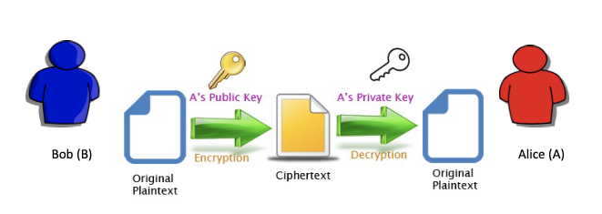
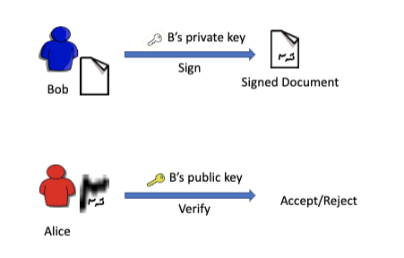
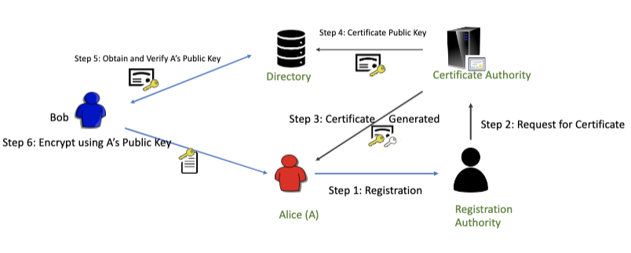
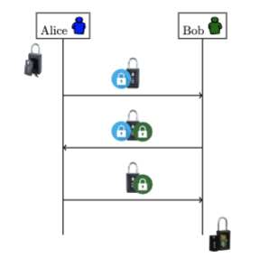
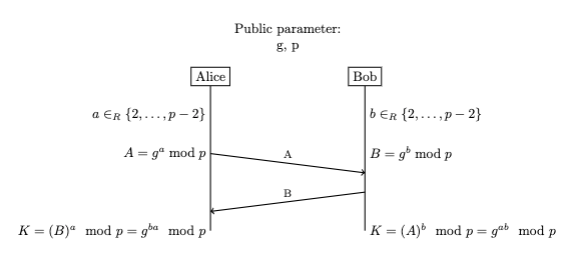
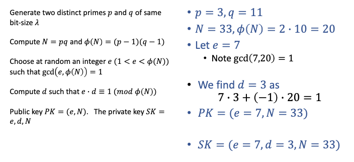
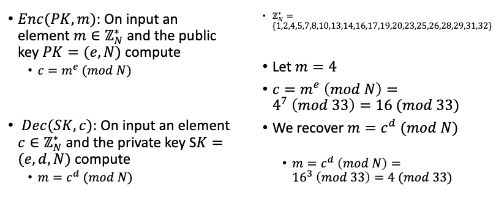
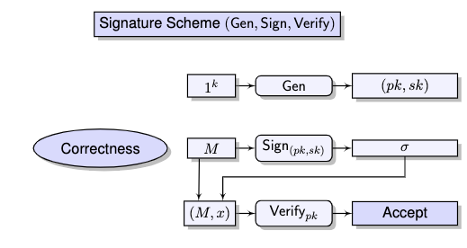
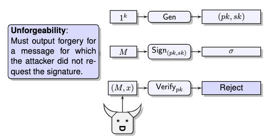

# Public-Key Cryptography

## 1. Intro

**Cryptohraphy has four directions**

1. Confidentiality 保密性

2. Message Integrity 消息完整性

3. Sender Authentication 发送人认证

4. (Soft) Sender Undeniability (non-repudiation) 发件人不可否认性

**Kerckhoffs' Principle**

- A cryptographic system should be secure even if everything about the system, except the key, is public knowledge.
- Modern Applications demand even Tamper-Resistance. 防篡改

### 1.1 Symmetric Key Cryptography

This means the keys for encryption and decryption are identical. 

**But there is a problem**: each pair of people who transfer data needs a separate key.

If there are 1000 people, 1000*(999)/2 = 499500 keys are needed.

If we use public and private key, then there are only 2000 keys are needed in total.

> 对称加密的最大问题是钥匙数量太多了，每两个人就需要一把钥匙，十个人就需要四十五把钥匙。

### 1.2 Reduce Keys number

- Each person has two keys: one **public** and one **private**
- They keys are asymmetric: **related but not identical**
- Public Key is known to everyone, private key is kept secret



Take home: Encryption using **receiver's public key**, decryption using **receiver's private key**.

> 这是非对称加密，B使用A的公钥对文件进行加密，发送给A。A使用自己的私钥对文件进行解密。
>
> 可是所有人都知道A的公钥，A怎么知道这条消息一定来源于B呢？<u>答案是使用独一无二的签名。</u>

### 1.3 Public Key authentication: Signatures

B对将要发送的文件（使用自己的私钥）进行签名，并发送出去。A收到文件并（使用B的公钥）进行验证。

> 这里很可能使用了对称加密。



### 1.4 Public Key Infrastructure

**RA**会验证用户的身份信息，然后将用户的公钥和身份信息打包成数字证书并颁发给用户。

**CA**是负责生成数字证书的权威机构，它会为用户生成公钥和私钥，并将其包含在数字证书中。

**Directory**是一个中央数据库，储存用户信息，公钥，以及其他与PKI相关的信息。



## 2. Secure Key Exchange

Now, Alice and Bobx need to agree on a secret key. But how?

**MultiRound Solution**

Public parameter: two sided lock box



### **2.1 Diffie Hellman Key Exchange**

Parameters: Choose a prime *p* and a number *g < p* such that *gcd(g, p-1) = 1*

比如：*p = 19*, *g = 18*, *19* 和 *18-1 = 17* 的最大公约数为 *1*

Assumption: There is no polynomial time algorithm to compute *g<sup>ab</sup> mod p* from *g<sup>a</sup> mod p* and *g<sup>b</sup> mod p*.

[Secret Key Exchange (Diffie-Hellman) - Computerphile from YouTube](https://www.youtube.com/watch?v=NmM9HA2MQGI)

[Diffie Hellman -the Mathematics bit- Computerphile from YouTube](https://www.youtube.com/watch?v=Yjrfm_oRO0w)



>  <u>Diffie Hellman 本质上是一个密钥交换协议，主要目的是实现两个通信方之间共享一个密钥。</u>
>
> 而下面提到的RSA本质上是一种非对称加密。

### **2.2 Man-in-the-Middle Attack**

MITM attack is a general term for when a perpetrator positions himself in conversation between a user and an application (or another user) -- either to eavesdrop(窃听) or to impersonate(扮演) one of the parties, making it appear as if a normal exchange of information is underway.

**How to solve?**

Basic idea: Authenticating Public Key

Requirement: Trusted Thrid Party: Certification Authority (CA).

## 3. RSA Encryption

RSA Encryption is the most popular function in public key cryptography.

Widely used in internet protocol like TLS, PKI.

### 3.1 Textbook RSA scheme

RSA原版加密

Three Algorithms (Gen, Enc, Dec)

- **Gen**: on input a <u>security parameter 𝜆</u>.

  Generate two distinct primes 𝑝 and 𝑞 of same bit-size 𝜆

  Compute 𝑁 = 𝑝𝑞 and 𝜙(𝑁) = ( 𝑝 − 1 )( 𝑞 − 1 )

  Choose at random an integer 𝑒 (1 < 𝑒 < 𝜙(𝑁)) such that gcd( 𝑒, 𝜙(𝑁) ) = 1

  Let ℤ<sub>N</sub><sup>*</sup>= {x | 0 < x <N and gcd(x, N)=1}

  Compute 𝑑 such that 𝑒 · 𝑑 ≡ 1 ( 𝑚𝑜𝑑 𝜙(𝑁) )

  Public key 𝑃𝐾 = (𝑒, 𝑁).   The private key 𝑆𝐾 = 𝑒, 𝑑, 𝑁

  > Gen 就是为了生成公钥私钥。

  **Example**:

  

- **Enc(PK, m)**: On input an element 𝑚 ∈ ℤ<sub>N</sub><sup>*</sup> and the public key 𝑃𝐾 = ( 𝑒, 𝑁 ) compute

  **𝑐=𝑚<sup>e</sup> (𝑚𝑜𝑑 𝑁)**

  > 加密函数：使用公钥Pk来对明文m进行加密。
  >
  > 第一步将明文m转换为整数（Unicode或ASCII），第二步使用公钥中的N和e来计算密文c。

- **Dec(SK, c)**: On input an element 𝑐 ∈ ℤ<sub>N</sub><sup>*</sup> and the private key S𝐾 = (𝑒, 𝑑, 𝑁) compute

  **𝑚=𝑐<sup>d</sup> (𝑚𝑜𝑑𝑁)**

  > 解密函数：使用私钥Sk来对密文c进行解密。
  >
  > 第一步将密文c转换为整数（Unicode或ASCII），第二步使用私钥中的N和d来计算明文m。
  
  **Examples:**
  
  

## 4. Digital Signatures

**Objectives**

1. Features of hand-written signatures in Digital World 手写签名在数据世界的特征
2. Ensure hardness of forgery 确保难以被伪造

> Explanation: When I want to send you something, I want to prove that it was me that sent it. To do that, I am going to use my private key to sign a digital signature. On your side, you are going to verify that signature, and verify that it was actually me that encrypted it.
>
> 发送方使用其私钥对消息的哈希值进行加密以创建数字签名，然后将数字签名附加到消息中。接收方可以使用发送方的公钥解密数字签名以获取哈希值，并使用同样的哈希算法对消息进行哈希。如果两个哈希值匹配，那么接收方可以确信消息没有被篡改，并且数字签名确实是由发送方创建的。

### 4.1 Hand-written Signatures

- **Function**: bind a statement/message to its authors.
- Verification is public. (Against a prior authenticated one)

- **Properties**:
  - Correctness: A correct signature should always be verified true.
  - Security: Hard to forge.

[What are Digital Signatures? - Computerphile from YouTube](https://www.youtube.com/watch?v=s22eJ1eVLTU)

### 4.2 Signature Schemes





> Gen -> 生成了公钥和私钥。
>
> Sign -> 使用明文（文件/数据）生成a（一个数字签名）。
>
> Verify -> 使用明文和x（签名）进行验证，如果验证正确则接受，错误则拒绝（错误意味着不是本人）。

通常情况下，数字签名的生成需要使用私钥，验证需要使用公钥。但是，在一些特定的数字签名方案中（比如上面这两张图），签名函数也需要使用公钥。这样做的原因是，为了防止恶意攻击者使用伪造的公钥来生成签名。如果只使用私钥生成签名，恶意攻击者可能会使用伪造的公钥来验证签名，从而欺骗接收者。因此，在一些数字签名方案中，签名函数的参数包含了公钥和私钥。

### 4.3 Signature Scheme Designs: RSA Full Domain Hash

- **Public Functions** A hash function H : {0, 1}<sup>\*</sup> --> Z<sub>N</sub><sup>*</sup> <u>把一个由0和1组成的序列转换为普通整数序列（Unicode或ASCII）</u>

- **Keygen** Run RSA.Keygen. *pk = (e, N), sk = (d, N).* <u>生成公钥和私钥</u>
- **Sign** **Input** *sk, M.* **Output** *σ = RSA.Dec(sk, H(M)) = H(M)<sup>d</sup> mod N* <u>使用私钥和明文进行签名，输出数字签名</u>

- **Verify** **Input** *pk,M,σ. If RSA.Enc(pk, σ) = H(M)* **Output** accept, else reject <u>使用公钥，明文和签名进行验证，输出接受或拒绝</u>

- if σ<sup>e</sup> mod N = H(M), **output** accept, else reject. <u>具体这么计算</u>

> A hash function takes strings of arbitrary length as input and produces a fixed length output. For cryptographic hash functions, given a *z*, it is very expensive to find x such that *H(x) = z*.
> 哈希函数无论输入的字符串有多长，它的输出都一样长，因此难以根据输出破解输入。

## 5. Public-Key Cryptography in Practice

**Saving a Key**

Can we read and write the bytes of a key to a file? This is a bad idea.

We want to

1. protect read access to private keys
2. make sure the publics ones are read

### 5.1 KeyStores and Java keytool

- `KeyStore` provides password protected storage for keys.
- Most Java programs use existing keys rather than create keys themselves.
- The keytool command can be used to generate keys outside Java.

**KeyStore**

A `KeyStore` holds password protected private keys and public keys as certificates.

```
// Make keystores using the keytool e.g.
keytool -genkey -keyalg RSA
				-keypass password  -alias mykey
				-storepass storepass
				-keystore myKeyStore
```

