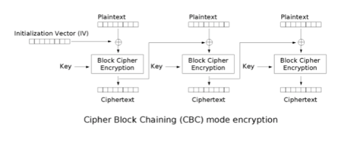
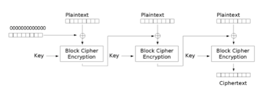
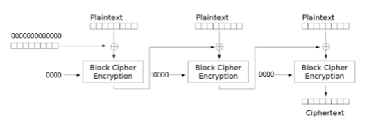
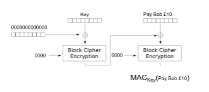
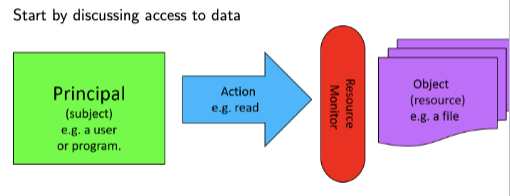
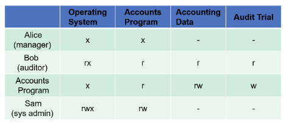
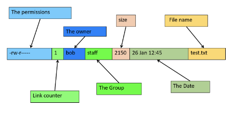
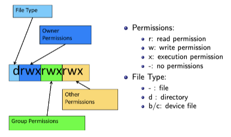

# 1. Hashes, MACs and Authenticated Encryption

Now we know that symmetric encryption works if participants share a key, we also know that public key cryptography and key distribution protocols can ensure that key is shared and safe. However, **we still need to detect manipulation of ciphertext.** Fortunately, Hashes, MACs and Authenticated Encryption can address this problem.

## 1.1 Hashes

- A hash of any message is a short string generated from that message. 哈希本质上是一小串字符

- The hash of a message is always the same. 相同信息会产生相同哈希
- Any small change makes the hash totally different. 不同信息会生成完全不同的哈希
- Hash -x-> Message 破译哈希非常困难

## 1.2	Uses of Hashing

- Verification of download of message
- Tying parts of a message together (hash the whole message)
- Hash the message, then sign the hash (for electronic signatures)
- Protect passwords: Store the hash instead of password 储存哈希值而不是密码，可以有效保护密码。

## 1.3 Attacks on hashes

- *Preimage attack* - Find a message for a given hash: very hard. 原像攻击
- *Collision attack* - Find two messages with the same hash.
- *Prefix collision attack* - A collision attack where the attacker can pick a prefix for the message.

## 1.4 The SHA Family of Hashes

SHA hashes are the most common and best hashes. SHA是最常见和最好用的哈希。

### 1.4.1 SHA-1 ❎

A birthday attack on SHA-1 should need 280 hash tests, but a 263 attack was found in 2005, thus it faded away.

### 1.4.2 SHA-2 ❎

Improved version of SHA-1: longer hash. It has 256 or 512 bits: also called SHA256, SHA512. Since it is from SHA-1, it has the same weakness, so cryptographers aren't happy.

### 1.4.3 The SHA-3 Competition ✅

Submissions opened on October 31, 2008. Winner was announced on October 2, 2012 as Keccak, (Daemen et al. the AES guy). And it was adopted as **NIST-standard** in 2015.

## 1.5 Merkle-Damgard Hashes (MD Hashes)

MD4 and MD5 are used, but weak, they are only useful when we only care about preimage attacks or integrity. MD6 is Ron Rivest's candidate for SHA-3, it seems good and fast.

## 1.6 Message Authentication Codes 消息认证码

[消息认证码是怎么一回事？](https://halfrost.com/message_authentication_code/) 该链接有详细的图解

[消息认证码与数字签名的理解](https://juejin.cn/post/6844904158319869960) 总的来说数字签名用非对称加密（且能验证身份），MAC用对称加密。

**MAC is a cryptographic checksum on data that uses a session key to detect both accidental and intentional modifications of the data.** MAC使用session key来检查对数据意外或蓄意的修改（e.g. CTR mode known plaintext attacks）。

- MAC, this MAC has nothing to do with MAC address for networking (MAC = Media Access Control)
- MACs sometimes used for authentication: **"Pay Bob 10 pounds", *MACk*("Pay Bob 10 pounds")**
- Possible attack on MAC: Add data to a MAC without knowing the key (Length extension attack)

> MAC 本质上是一种消息摘要算法，它最重要的的功能就是确定消息是否被修改。

### 1.6.1 Block Cipher Modes

CBC常被用于MAC加密。

This is how a CBC encryption is

We can turn it into a MAC

> 1. 明文分块，然后生成IV，第一个明文块与IV进行XOR
> 2. 使用一个特定用于MAC的钥匙，把XOR后的值进行加密
> 3. 加密后的值与下一块的明文XOR，然后从第二步开始重复
> 4. 直到最后一个块加密结束，生成密文

Here is an inefficient Hash Function: we set Key as *0000*

### 1.6.2 Broken Hash to MAC

- If we had a Hash we could try to make a MAC by: *MACKey(M) = H(Key, M)*
- This is vulnerable to length extension attack

> 可以用Hash加密，但是易被长度扩展攻击。

## 1.7 Authenticated Encryption Modes

- Authenticated encryption modes can stop Known plain text attack. <u>换句话说，它可以阻止CTR被known plain text攻击。</u>

- With Authenticated Encryption you can only form a valid ciphertext if you know the key.
- Most common way to do this is to add a MAC to the ciphertext.

## 1.8 CCM mode encryption

1. Calculate an AES CBC-MAC on the data.
2. Encrypt the message followed by the MAC using the same key and CTR mode.

> This is not too advanced, but it is proven secure, fully defined as RFC 3610.
>
> 本质上为Counter with CBC-MAC mode。
>
> 前面提到了MAC加密后要发送的内容大概是这样的："Pay Bob 10 pounds", *MACk*("Pay Bob 10 pounds")
>
> CCM就是在这个基础上，再把明文部分再进行CTR模式加密：CTR("Pay Bob 10 pounds"), MACk("Pay Bob 10 pounds")

# 2. Access Control

For security, we need to ensure that only authorised users have access to what they need, and we will discuss the ways of achieving this and possible pitfalls.

## 2.1 Model of Access Control

## 2.2 Access Control Matrix

Permission: `x` execute, `r` read, `w` write.

- ACM is a matrix of all principals and objects
- Problem: maintaining such a matrix can be difficult, how?
- If the matrix is corrupted, then all control is lost.

## 2.3 Access Control Lists (ACLs)

We don't want to store one massive matrix, instead, we just store each column of the matrix with the object it refers to: *(Accounts data, [(Sam, r), (Bob, r), (Accounts program, rw)])*

> 为了避免那么大一个ACM难以维护的问题，我们可以改用列表。
>
> 格式为：（资源，[（用户1，权限类型），（用户2，权限类型），（用户3，权限类型]）

## 2.4 The UNIX Access Control List

> It seems like 'The permissions' contains all permissions and uses a particular format. Here it is.
>
> Permissions块使用了特定的格式。

**UNIX File Permissions**

这个图是上面The permissions的细节版，第一个字母表示`d`表示文件类型为文件夹。总共十个字符，如果为`-`的话表示没有这个权限。

### 2.4.1 Access Control for Directories

<u>对于文件夹的访问控制</u>

- For directories
  - `r` is read only for dir contents. 只读模式
  - `x` is permission to traverse, e.g. switch to, run. 可以执行
- No `x` I can't run any commands inside the dir 不可执行
- No `r` I can't list the files in the dir 不可列出文件夹里的文件

### 2.4.2 Access Control for Program

`-r-sr-xr-x	1 root 	wheel 70352 19 Jun 2009 passwd`

- The `x` permission controls who can run a program in the case of `passwd`: anyone. passwd是文件名

- The `s` permission indicates that the program runs with the permission of its owner.

  在这个权限中，`s`标记实际上是`setuid`标记。设置`setuid`标记的文件在执行时，将以该文件的所有者的身份来执行，而不是执行文件的用户的身份。

## 2.5 Different user identifiers

- Have different user identifiers (uids)
  - Real uid (ruid) owner of process
  - effective uid (euid): used for access checks (except filesystem)
  - file system uid (fsuid): used for access checks and ownership of files (usually equal to effective uid)
  - saved user uid (suid): when the euid is changed, the old euid is saved as suid. Unprivileged process may change euid only to ruid or suid.
- Provides flexibility for granting higher privileges temporarily
  - E.g. daemons: start as root, then set ruid, euid and suid to unprivileged values. Cannot gain root privileges afterwards.
  - Process run as privileged user may set euid to unprivileged value, then execute non-privilieged operations, and gain root privileges afterwards.

> Granting higher privileges has security issues:
>
> Users can run process with more privileges. If there was a mistake in the passwd program we could use it do root only actions.
>
> Particular problem: race condition in code like
>
> `if can_access file then perform_operations on file`
>
> **Make sure process have as low a level as possible**

## 2.6 Storing Passwords

- Passwords not stored in clear text, <u>only hashes are stored</u>.
- Further security measure: Store pair (Salt, Hash), where Salt is random bit string, and Hash is the hash of the salt and the password.
- 同样密码不同用户会在密码文件中存入不同的项。
- 让密码破解难度上升。

> 题外话，登录账号时，用户先输入密码。系统将该密码以之前一样的方式添加Salt（随机数），可能是密码前面，可能是密码后面，总之与之前是一样的。然后系统将加过Salt的密码整个用之前一样的方法进行哈希。最后得出来的值再与密码库的哈希值比较，如果一样则验证通过，这样即使是两个用户用相同的密码，他们的hash也会因为salt不同而不同，这样提高了密码安全性。

### 2.6.1 Windows Password Hashes

- Windows stores its password hashes in: system32/config/SAM
- This file requires Admin level to read
- It is locked and encrypted with a key, based on other key values.

> Getting Windows Password Hashes: 1) Boot into Linux 2) Get SAM file

### 2.6.2 Password Hashes in Windows Domain

- Windows domain中，密码哈希用来验证域名中主机上的用户。
- 密码会被放入cache中防止询问密码，但这会提高被攻击的风险。
- 存在防御机制，但不好用。
- ssh是更好的选择：公钥在未信任的机器上，私钥在信任的机器上。

## 2.7 Password capture by attacker

**Phishing** - Username and password captured by attackers via malicious links.

- Used to login and then for attacks (ransomware, theft of credit card details, IP...)
- Best protection: multi-factor authentication (something else apart from username and password)
- ssh with public key authentication only also protects against phishing.

## 2.8 Better Security: BIOS

- Set a password in the BIOS to stop the computer booting from anything but the hard disk. 在BIOS设置密码来防止计算机从硬盘以外的设备启动。
- It is very hard to brute force the BIOS. 破解BIOS密码非常困难。
- Workaround: remove the hard disk from the computer or reset BIOS password.

> BIOS（Basic Input/Output System）是一种存储在计算机主板上的固件程序，它在计算机启动时运行，控制着计算机的基本输入输出和硬件操作。为了保护计算机不被未经授权的用户访问和篡改，可以在BIOS中设置密码。这样，只有输入正确的密码才能启动计算机。由于BIOS存储在主板上，因此破解BIOS密码非常困难。如果忘记了密码或需要解除密码保护，可以通过拆卸硬盘或重置BIOS密码来解决。

## 2.9 Best Security

- Encryption of important file.
- Whole disk encryption
  - Encrypt the whole hard drive
  - Key can be brute forced
  - Not safe if the computer is in sleep mode.
- E.g. BitLocker, FileVault, Luks