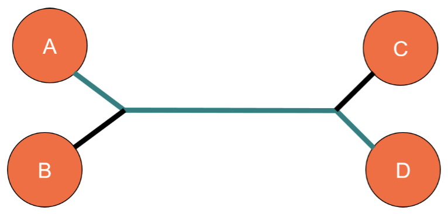
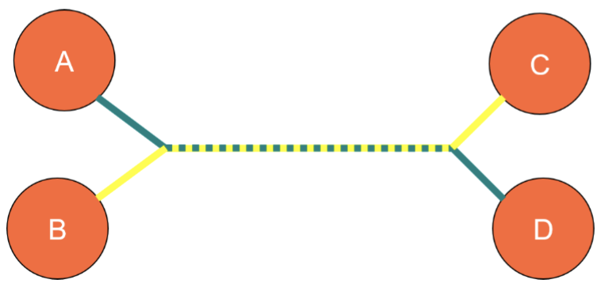
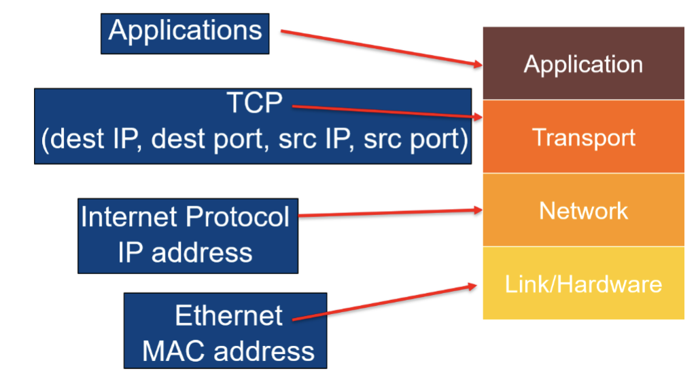
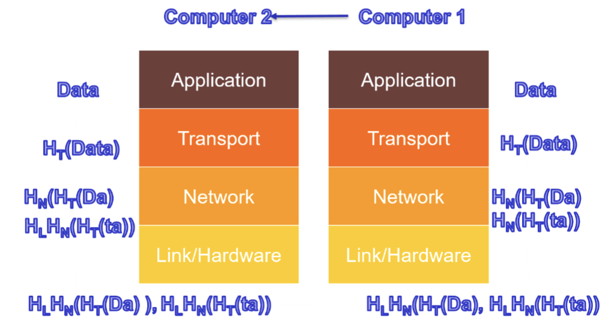
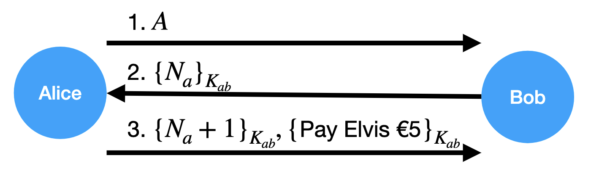
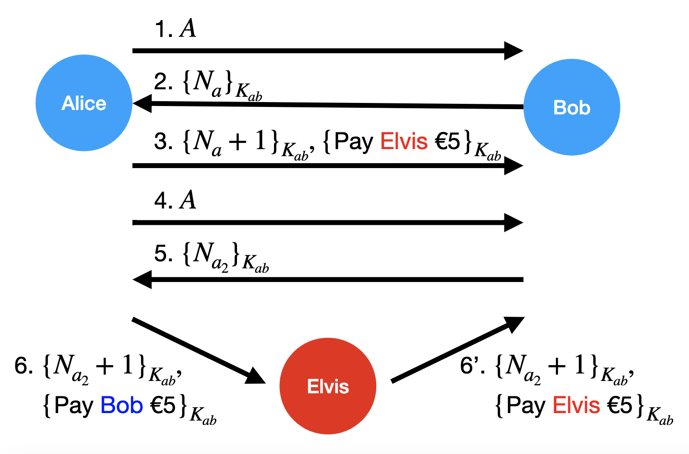
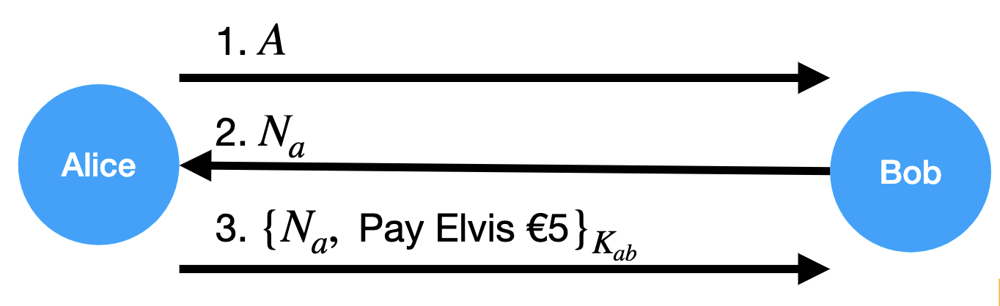
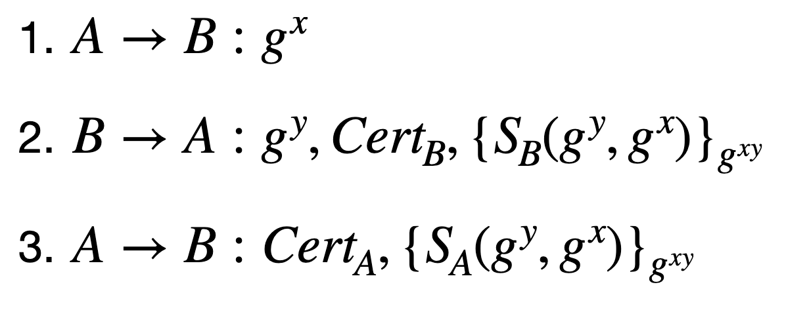
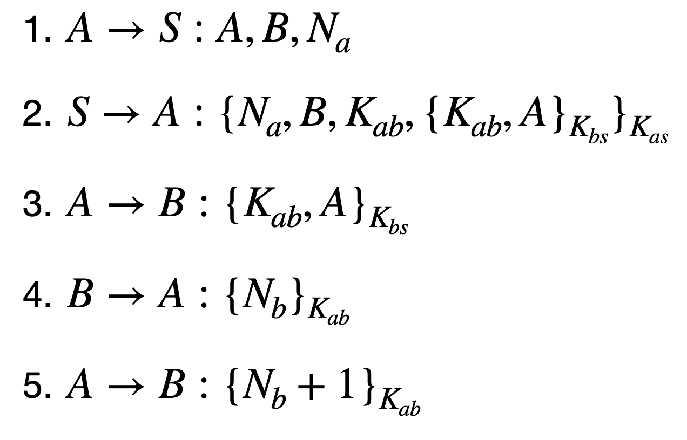

# 1. The Internet and Socket

Before the internet, we used local networks, telephone line connections, and leased line. But the problem with leased lines is that: If A and D use the line, then B and C cannot.

But if everyone just sends a small packet of data, they can both use the line at the same time.

## 1.1 Transmission Control Protocol

- TCP is a protocol that runs on top on IP, if an IP packet gets lost. It requests to re-sent.

- TCP/IP becomes standard and allows Inter network connections.

## 1.2 Domain Name Server (DNS)

- Remembering IP address is hard, so people associate names with addresses.
- news.bbc.com -> 212.58.226.141
- A hierarchy of servers list handle requests
- The route for most of Europe is RIPE based in Amsterdam.

> 由于记住那么多完整的IP地址很困难，所以DNS就像电话薄一样，通过输入相关名字，比如 google.com，浏览器就能直接将我们连接到其对应的IP地址。

## 1.3 Ports 端口

- To allow multiple connections TCP uses "ports"
- 一个 TCP Socket connection is defined by：dest IP, dest port, source IP, source port
- The dest port normally depends on the service: WWW runs on port 80, ssh on port 22, dns on 53...
- The source port is normally chosen at random

> Socket = (IP: port) Socket 的含义就是两个应用程序通过一个双向的通信连接实现数据的交换，连接的一段就是一个socket。实现一个socket连接通信至少需要两个sockets，一个运行在服务端（插孔），一个运行在客户端（插头）。
>
> 套接字用于描述IP地址和端口，是一个通信链的句柄。应用程序通过套接字向网络发出请求或应答网络请求。注意的是套接字既不是程序也不是协议，只是操作系统提供给通信层的一组抽象API接口。

## 1.4 Netcat

- Netcat is a tool to make Internet connections

- Syntax varies between OS. 不同的OS上使用不同语法
- listen on 1337: nc -l 1337
- connect to machine 127.0.0.1 on port 1337:
  - nc 127.0.0.1 1337

> [Netcat tutorial](https://www.freebuf.com/sectool/243115.html) in Chinese

## 1.5 Nmap

- Check if 1000 most common ports are open:
  - nmap 127.0.0.1
- Additionally send messages to ports to find out what the service is:
  - Map -A 127.0.0.1
- Scan all ports:
  - Map -p- 127.0.0.1

> 127.0.0.1 is a non-routable IP address that is defined as referring to the "local" computer. In other words, it is any computer you sit in front of right now.

## 1.6 The Internet Protocol Stack

互联网协议栈

- Internet communication uses a stack of protocols.
- Each protocol uses the protocol below it to sent data.

## 1.7 MAC and IP Address

- Every machine has a unique MAC address (media access control)
  - e.g. 48:d7:05:d6:7a:51
- Every computer on the Internet has an IP address
  - e.g. 147.188.193.15
- NAT address 10.\*.\*.\* and 192.168.\*.\* are not unique local address.

## 1.8 DHCP and ARP

- Dynamic Host Configuration Protocol 动态主机配置协议

  - Assigns an IP address to a new machine (MAC address). Not stored long term.

  > 用于集中对用户IP地址进行动态管理和配置

- Address Resolution Protocol (ARP) 地址解析协议

  - Lets router find out which IP address is being used by which machine.
  - ARP spoofing lets one machine steal the IP address of another on the same network.

  > 使得路由器可以找到哪台主机在用哪个IP地址

## 1.9 Wireshark

- A network protocol analyzer: It records all internet traffic, so it can then be viewed and analysed. Wireshark 是一个网络封包分析软件，可以实时从网络接口捕获数据包中的数据。
- Excellent for debugging protocols and network problems.
- See also tcpdump, which writes packets directly to disk.

> TCPDump 可以将网络中传送的数据包完全截获下来提供分析，它针对网络层、协议、主机、网络或端口的过滤。

## 1.10 Using the Stack to Send Data

从 Computer 1 发送数据到 Computer 2。首先数据经过 Transport 层，UDP 给每个数据包都添加了一个 header，其中包含发送和接收的端口，数据包的长度，以及 checksum 校验和。在 Network 层，为数据包打上 MAC 地址和 IP header，并拆分过大的数据。在 Link 层，打上该层的 header。

## 1.11 "The Attack Owns the Network"

- The Internet was not designed with security in mind
- Traffic may be monitored or altered
- All good security products assume that the attacker has complete control over the network (but can't break encryption)

# 2. Cryptographic Protocols

- Protocols in Alice and Bob notation
- Attacks on Protocols
- Forward Secrecy
- Goals and Protocols

## 2.1 A simple protocol

A sends a message m to B

`Alice -----"I'm Alice"-----> Bob`

written as: A --> B: "I'm Alice"

---

There are some rules: We write down protocols as a list of messages sent between principals, e.g.

1. A --> B: "Hello"
2. B --> A: "Offer"
3. A --> B: "Accept"

在上述的例子中`Alice -----"I'm Alice"-----> Bob`， 该信息`"I'm Alice"` 可以被攻击者读取。

就会变化成 `Alice     Elvis -----"I'm Alice"-----> Bob`

 写作 E(A) -> B: "I'm Alice"

---

`Alice -----{"I'm Alice"}Kab-----> Bob`

{_}Kab means symmetric key encryption

written as: A --> B: {"I'm Alice"}Kab

---

A --> B: {"I'm Alice"}Kab

E(A) --> B: {"I'm Alice"}Kab

- Attacker can intercept and replay messages.
- Assume the attacker "owns" the network.

## 2.2 A Nonce

Numbr that is only used once (often used in a challenge/response setting).

在第三条信息中，由于 N_a + 1 是使用和A公用的钥匙来加密的，因此B认为A肯定是想把钱转给Elvis。

但这个方法是有很大漏洞的。

Elvis知道Alice发的第一条消息是Bob用来验证Alice身份的密码，因此Elvis直接replay这条消息，并且将上一次Alice说的Pay Elvis再replay进入新信息里打包发给Bob。Bob检查随机数Nonce正确，而信息是Pay Elvis，Bob就再一次把钱打给了Elvis。在此过程中Elvis完全不需要知道Kab是什么，他只要replay信息就可以了。这个问题的解决办法在下一个小节。

## 2.3 A better protocol

Alice亮明身份，Bob发送不需要加密的Nonce，这个Nonce会被网络的拥有者看到，但是无所谓。Alice紧接着把收到的N和消息一起打包加密，这样的话，不知道Kab的Elvis就没有办法解开这一条完整的信息。

What can Bob be sure of after such a protocol run?

1. He is talking to Alice
2. Alice wants to send Elvis 5 euro
3. A's messages are fresh (not replayed)

## 2.4 Key Establishment Protocol

- This protocol was possible because A and b shared a key
- Often, the principals need to set up a session key using a **Key Establishment Protocol**
- To be sure they are communicating with the correct principal, they must either know each others public keys or use a **Trusted Third Party (TTP)**

## 2.5 The Needham-Schroeder Public Key Protocol

**E_x(_) means public key encryption**

Assume Alice and Bob know each others public keys, can they set up a symmetric key?

1. A --> B: E_B(N_a, A)
2. B --> A: E_A(N_a, N_b) <u>A: "The only person who could know N_a is the person who decrypted the first message"</u>
3. A --> B: E_B(N_b) <u>B: "The only person who could know N_b is the person who decrypted the second message"</u>

消息1: Alice 亮明身份 + 发送 Nonce A + 使用 Bob 公钥加密

消息2: Bob 用私钥打开后 + 打包 Alice 给的 Nonce A 和自己的 Nonce B + 使用 Alice 公钥加密

消息3: Alice 用私钥打开后 + 取出 Nonce B 并单独打包 + 使用 Bob 公钥加密

N_a 和 N_b 这样就能被用于生成对称钥匙。

目标：Alice 和 Bob 确定自己在和对方对话，并且只有他们知道对称钥匙。

## 2.6 An attack against the NH Protocol

**The attacker C acts as a man-in-the-middle:**

Suppose A wants to make a connection with C

1. **A --> C: E_C(N_a, A)** <u>A向C亮明身份（C得到N_a）</u>
   1. C(A) --> B: E_B(N_a, A) <u>C把内容打包好发给B</u>
   2. B --> C(A): E_A(N_a, N_b) <u>B要求验证身份</u>
2. **C --> A: E_A(N_a, N_b)** <u>C把B发来的内容打包好发给A</u>
3. **A --> C: E_C(N_b)** <u>A解开并发给C（C得到N_b）</u>
   3. C(A) --> B: E_B(N_b) <u>C打包内容发给B B以为自己在和A说话</u>

**Solution is simple:**

1. A --> B: E_B(N_a, A)
2. B --> A: E_A(N_a, N_b, **B**) 添加B的身份，如果A收到这个消息，就会发现自己在跟B沟通而不是C
3. A --> B: E_B(N_b)

## 2.7 Forward Secrecy

1. A --> B: E_B(N_a, A)
2. B --> A: E_A(N_a, N_b, B)
3. A --> B: E_B(N_b)
4. B --> A: **{M}key(N_a, N_b)** 用刚才双方验证过的N_a, N_b来建立了shared key

Secure against the "standard" attacker: *intercept, replay, delete, alter*

What about government? After the protocol runs, governments can legally force people to handover their private keys.

Can we protect against this?

---

A protocol has *Forward Secrecy* if it keeps the message secret from an attacker who has:

- A recording of the protocol run
- The long term keys of the principals

Protection against a government that can force people to give up their keys, or hackers that might steal them.

## 2.8 Station-to-Station Protocol

> S_X(_) means signed by X

这个例子中假设了双方都知道对方的public key

1. A --> B: g^x <u>此处g^x的作用是否和Nonce相似？</u>
2. B --> A: g^y, {S_B(g^y, g^x)}_g^(xy) <u>此处的signature是为了确保A和B在和对方对话</u>
3. A --> B: {S_A(g^y, g^x)}_g^(xy)
4. B --> A: {M}_g^(xy)

- x, y, g^(xy) are not stored after the protocol run.
- A and B's keys don't let the attacker read M.
- **STS has forward secrecy**.

## 2.9 Certificates

- What if Alice and Bob don't know each other's public keys to start off with?
- Could meet face-to-face and set up keys or get a trusted third party (TTP) to sign their identity and public key: **a certificate**.

**Full Station-to-Station Protocol**

- The "full" STS protocol adds certificates for A and B.
- These contain their public key signed by a TTP, so Alice and Bob don't hae to know each other's public key.

## The Needham-schroeder key establishment protocol

A and B use TTP S to establish a key K_ab:

1. A 发给 S 表示自己要和B建立联系 并提供 Nonce A
2. S 回复 A 并提供 AB沟通的钥匙K_ab，以及只有S和B能打开的数据包，里面是钥匙K_ab和A的身份
3. A 把 S 给的小数据包给 B，里面有AB的钥匙K_ab和A的身份
4. B 打开包 并用K_ab加密 Nonce B 发送给 A
5. A 打开包 Nonce B + 1 加密后发给 B 来验证身份

## 2.10 Some Key Establishment goals

- Key Freshness: 建立的钥匙是新的（要么来自TTP要么来自全新的Nonce随机数）
- Key Exclusivity: 钥匙只能被协议中的委托人所知晓
- Good key: 钥匙同时是 fresh 和 exclusive 的。

## 2.11 Authentication Goals

- **Far-end Operative**: A knows that "B" is currently active.

  For instance B might have signed a nonce generated by A, e.g.

  1. A --> B: N_a
  2. B --> A: S_B(N_a)

  Not enough on its own (e.g. Needham-Schroeder protocol).

- **Once Authentication**: A knows that B wishes to communicate with A.

  For instance, B might have the name A in the message, e.g.

  1. B --> A: S_B(A)

## 2.12 Entity Authentication

Both of these together give

- **Entity Authentication**: A knows that B is currently active **and** wants to communicate with A.
  1. A --> B: N_a
  2. B --> A: S_B(A, N_a)

## 2.13 The highest goal

A protocol provides **Mutual Belief** in a key K for Alice with respect to Bob if after running the protocol, Bob can be sure that:

1. K is a good key with A
2. Alice can be sure that Bob wishes to communicate with Alice using K
3. Alice knows that Bob believes that K is a good key for B

>Mutual Belief in Key
>
>|----- Good Key
>
>​			|----- Fresh Key
>
>​			|----- Key Exclusivity
>
>|----- Entity Authentication
>
>​			|----- Far-end Operative
>
>​			|----- Once Authentication

The main-in-the-middle attack against NH Public Key Protocol mentioned above:

✅ Fresh Key

❌ Key Exclusivity

✅ Far-end Operative

❌ Once Authentication
