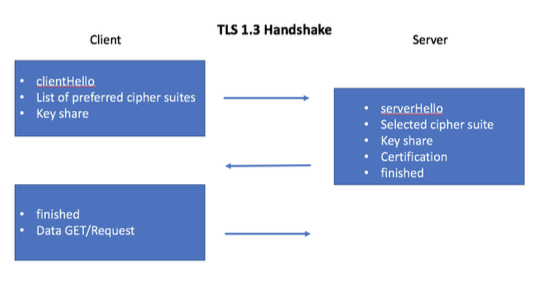
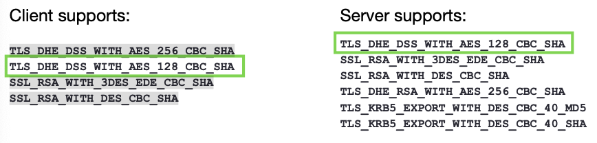
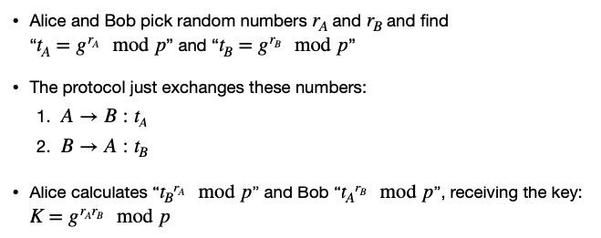
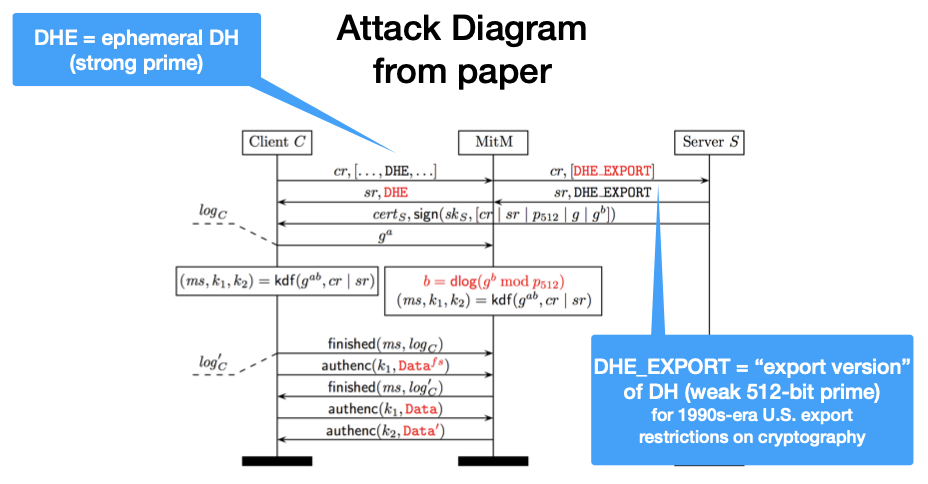
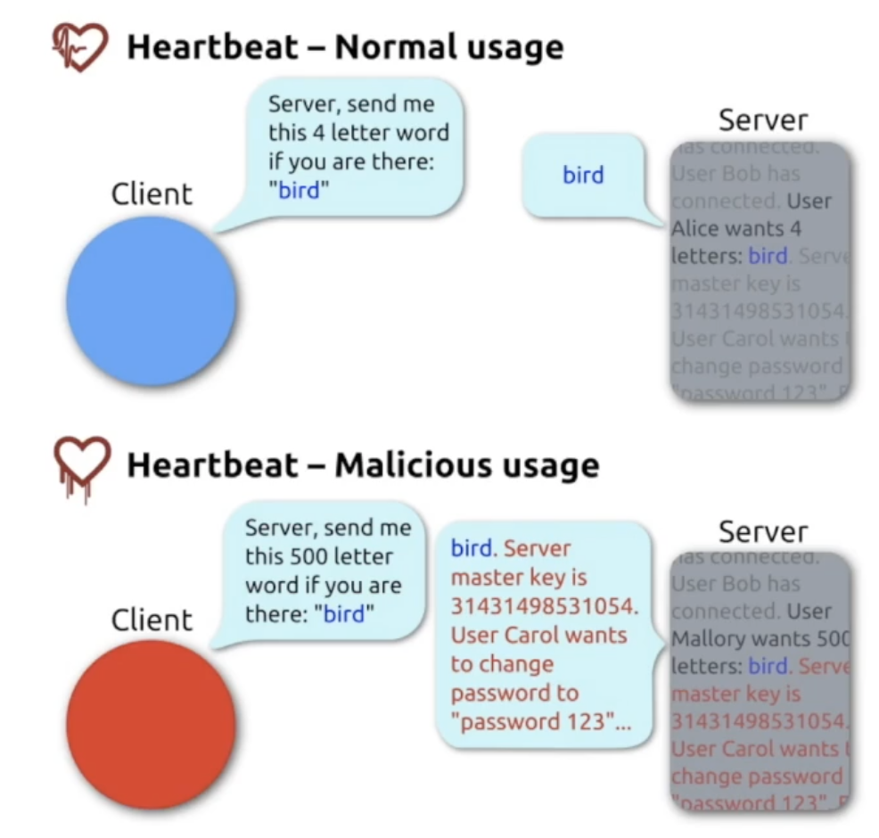

# 1. TLS

- How it works?
- Common problems

## 1.1 The SSL/TLS Protocol

- The Secure Sockets Layer (SSL) protocol was renamed to Transport Layer Security (TLS) protocol.
- It provides encrypted socket communication and authentication, based on public keys.
- It may use a range of ciphers (RSA, DES, DH, ...)

> 安全传输层协议用于在两个通信应用程序之间提供保密性和数据完整性。
>
> - **加密：**隐藏从第三方传输的数据。
> - **身份验证：**确保交换信息的各方是他们所声称的身份。
> - **完整性：**验证数据未被伪造或篡改。

## 1.2 X.509 Standard for Certificates (证书的标准)

- These certificates contains a subject, subject’s public key, issuer name, etc.
- The issuer signs the hash of all the data
- To check a certificate, I hash all the data and check the issuers public key.
- If I have the issuer's public key and trust the issuer, I can then be sure of the subject's public key.

> X.509 是用于标准格式的公钥证书，是将加密密钥对与网站，个人或组织等身份安全地关联的数字文档。

[什么是X.509证书?](https://www.ssl.com/zh-CN/%E5%B8%B8%E8%A7%81%E9%97%AE%E9%A2%98/%E4%BB%80%E4%B9%88%E6%98%AFx-509%E8%AF%81%E4%B9%A6/)

[What is X.509 Certificate?](https://www.ssl.com/faqs/what-is-an-x-509-certificate/)

## 1.3 The Internet Protocol Stack

### 1.3.1 Most of the Time

| Layer         | Protocol             |
| ------------- | -------------------- |
| Application   | Stuff that you write |
| Transport     | TCP or UDP           |
| Network       | IP                   |
| Link/Hardware | Ethernet or 802.11   |

### 1.3.2 With TLS

- The TLS layer runs between Application and Transport layer.
- The encryption is transparent to the Application layer.
- Normal TCP and IP protocols etc. can be used at the low layers.

> HTTPS是在 HTTP 协议基础上实施 TLS 加密，所有网站以及其他部分 web 服务都使用该协议。因此，任何使用 HTTPS 的网站都使用 TLS 加密。

## 1.4 How TLS works

在该例子中，我们假设双方已经决定好使用某一cipher。

1. C --> S: N_c 客户端发送Nonce至服务器
2. S --> C: N_s, Cert_s 服务器发送新Nonce和证书至客户端 让客户端查看
3. C --> S: E_s(K_seed), {Hash_1}_Kcs 客户端用证书中提到的方式加密Seed钥匙 并用创建的Kcs钥匙加密hash值
4. S --> C: {Hash2}_Kcs

Hash计算的方式为：前面的所有消息都被hash并被Kcs加密以保证完整性

- Hash1 = #(N_c, N_s, E_s(K_seed))
- Hash2 = #(N_c, N_s, E_s(K_seed), {Hash1}_Kcs)

Kcs is a session key based on N_c, N_s, K_seed.

## 1.5 TLS-DHE

A variant uses Diffie-Hellman for *forward secrecy*

i.e. if someone gets the server's key later, they can't go back and break a recording of the traffic.

1. C --> S: N_c
2. S --> C: N_s, g^x, Cert_s, Sign_s(#(N_c, N_s, g^x)) 此处的签名只是前面所有内容的hash 加上服务器的签名
3. C --> S: g^y, {#(All previous messages)}_Kcs
4. S --> C: {#(All previous messages)}_Kcs

Kcs is a session key based on N_c, N_s, g^(xy)

## 1.6 Cipher Suites

Cipher Suites with encryption and authentication:

```
SSL_RSA_WITH_3DES_EDE_CBC_SHA
SSL_RSA_WITH_DES_CBC_SHA
SSL_RSA_WITH_RC4_128_MD5
SSL_RSA_WITH_RC4_128_SHA
TLS_DHE_DSS_WITH_AES_128_CBC_SHA
TLS_DHE_DSS_WITH_AES_256_CBC_SHA
TLS_DHE_RSA_WITH_AES_128_CBC_SHA
TLS_DHE_RSA_WITH_AES_256_CBC_SHA
TLS_KRB5_EXPORT_WITH_DES_CBC_40_MD5
TLS_KRB5_EXPORT_WITH_DES_CBC_40_SHA
...
```

Cipher suites with just authentication:

```
SSL_RSA_WITH_NULL_MD5
SSL_RSA_WITH_NULL_SHA
```

Cipher suites with just encryption:

```
SSL_DH_anon_EXPORT_WITH_DES40_CBC_SHA
SSL_DH_anon_EXPORT_WITH_RC4_40_MD5
SSL_DH_anon_WITH_3DES_EDE_CBC_SHA
SSL_DH_anon_WITH_DES_CBC_SHA
SSL_DH_anon_WITH_RC4_128_MD5
TLS_DH_anon_WITH_AES_128_CBC_SHA
TLS_DH_anon_WITH_AES_256_CBC_SHA
```

**In TLS 1.0-1.2**

**Algorithms supported in TLS 1.0-1.2 cipher suites**

| Key exchange/agreement | Authentication | Block/stream ciphers | Message authentication |
| ---------------------- | -------------- | -------------------- | ---------------------- |
| RSA                    | RSA            | RC4                  | Hash-based MD5         |
| Diffie-Hellman         | DSA            | Triple DES           | SHA hash function      |
| ECDH                   | ECDSA          | AES                  |                        |
| SRP                    |                | IDEA                 |                        |
| PSK                    |                | DES                  |                        |
|                        |                | Camellia             |                        |
|                        |                | ChaCha20             |                        |

## 1.7 Cipher Suites Handshake



## 1.8 Weakness in TLS

Configuration weakness:

- Cipher downgrading 攻击者故意让系统使用老旧的，安全性差的工作方式，比如明文通讯。
- Self-signed certificates 自签名证书无需认证，因此用户应该在明确知道该凭证是属于对方时才信任。

Direct attack against implementations:

- Apple's goto fail bug
- LogJam attack
- HeartBleed

### 1.8.1 Cipher downgrading attack

Ciphers are listed in the order of preference.



优先查看Client supports的第一行，看Server support里有没有对应。如果没有，就看Client supports第二行，再Server supports里找对应。

但是这可以被降级：


这个情况下，被迫使用了一个低级的cipher suite。这些cipher suite messages是没有被认证的。

一个拥有该网络的攻击者可以移除强力的ciphers，如果客户端和服务器都支持一个更低级的cipher，那攻击者就可以强制使用它。

### 1.8.2 Self-signed certificates

- Maintaining a set of certificates is hard (especially on apps and IoT devices).
- It's much easier just to accept any certificate (or certificates that sign themselves).

The problem is: If the client accepts the self-signed certificates, then it's easy to man-in-the-middle.

> 因为难以维持一组认证，干脆什么认证都接受。这样就会导致中间人攻击。

### 1.8.3 Cipher suites

- 如果一方有较弱的 cipher suite 而另一方没有呢？
- 一般情况下，这是安全的。
- 浏览器开发人员移除所有弱的ciphers，只留下强力的在服务器里。
- 取决于不同cipher suite的不兼容情况。比如：
  - `SSL_RSA_WITH_DES_CBC_SHA`
  - `TLS_DHE_DSS_WITH_AES_256_CBC_SHA`

### 1.8.4 LogJam

- The Snowden leaks revealed that the NSA regularly MITMed TLS.
- Why? [https://weakdh.org/imperfect-forward-secrecy-ccs15.pdf](https://weakdh.org/imperfect-forward-secrecy-ccs15.pdf)
- A weak Diffie Hellman key is compatible with a strong Diffie Hellman key!

> [Logjam是个什么鬼？](https://www.aqniu.com/vendor/7758.html)

Logjam使用了Diffie Hellman的漏洞，如何做到的？

**原本的生成密钥的方式：**



通过一个很大的 prime number P, 来确保密钥K难以被破解。但是这可以被中间人攻击所降级，使P不够大，让破解的难度降低。



第一行，客户端告诉服务器能支持如下Cipher suites，其中包含`DHE`，一个有强力P的加密方式。中间人截获后，改成`DHE_EXPORT`，这个版本和`DHE`没什么不同，但P很弱。服务器根据要求发送了客户端需要的内容，客户端收到后并不知道自己使用了弱版本`DHE`，认为没有问题后发送了`g^a`, 但由于P很弱，密钥可以被暴力破解出来，中间人成功欺骗了客户端。

### 1.8.5 HeartBleed

A programming error in OpenSSL.



由于代码失误，服务器会返回其他在内存里的信息。有可能泄露主密码。

## 1.9 TLS 1.3

- Newest standard, ratified August 2018 最新标准
- Remove obsolete cryptographic protocols 移除旧版的加密协议
- Simplified handshake --> efficiency gain 简化握手
- Forward secrecy mandatory 强制正向加密
- Intercepting TLS connections now only possible as active attacker performing MITM attack

# 2. Tor

- Anonymity on the internet
- The Tor Protocol
- Hidden servers

## 2.1 Virtual Private Networks

- VPNs securely connect you to another network
- Secured with certificates and encryption, e.g., TLS or IPSec.

## 2.2 VPN for Anonymity

To get some anonymity, you can route all your traffix via the VPN.

- Server thinks you are the VPN provider
- ISP only sees the connection to the VPN
- A global observer can probably link your connections.

There is **no anonymity** to the VPN provider.

___

What information does the **WiFi** provider have about you?

| Info                                                   | Yes or No |
| ------------------------------------------------------ | --------- |
| ...your WiFi's outgoing IP address                     | Yes       |
| ...that you are connected to the VPN                   | Yes       |
| ...your VPN's outgoing IP address                      | No        |
| ...that you are browsing to "https://bham.ac.uk"       | No        |
| ...the contents of your communication with the website | No        |

What information does the **VPN** provider have about you?

| Info                                                   | Yes or No |
| ------------------------------------------------------ | --------- |
| ...your WiFi's outgoing IP address                     | Yes       |
| ...that you are connected to the VPN                   | Yes       |
| ...your VPN's outgoing IP address                      | Yes       |
| ...that you are browsing to "https://bham.ac.uk"       | Yes       |
| ...the contents of your communication with the website | No        |

What information does the **Website** provider have about you?

| Info                                                   | Yes or No                                 |
| ------------------------------------------------------ | ----------------------------------------- |
| ...your WiFi's outgoing IP address                     | No                                        |
| ...that you are connected to the VPN                   | No (Might infer that from the IP address) |
| ...your VPN's outgoing IP address                      | Yes                                       |
| ...that you are browsing to "https://bham.ac.uk"       | Yes                                       |
| ...the contents of your communication with the website | Yes                                       |

## 2.3 Onion Routing

- You get the best anonymity by routing your traffic via a number of proxies.
- Onion Routing ensures that your message really is routed via the proxies you want.

> 洋葱路由是一种在网络上匿名沟通的技术，信息一层一层的加密包装成杨松一样的封包，並經由一系列被稱作洋蔥[路由器](https://zh.wikipedia.org/wiki/路由器)的網路節點傳送，每經過一個洋蔥路由器會將封包的最外層解密，直至目的地時將最後一層解密，目的地因而能獲得原始訊息。而因為透過這一系列的加密包裝，每一個網路節點（包含目的地）都只能知道上一個節點的位置，但無法知道整個傳送路徑以及原傳送者的位址。From wikipedia

## 2.4 Tor: Onion Routing

- 每个Proxy只知道它上一个Proxy的IP和下一个Proxy的IP，所以不知道整个路径。
- 每个Proxy的公钥是已知的。
- 第一个节点Node可见源IP，最后一个节点Node可见目的地IP。
- 用户选择三个Proxies (Entry, middle, exit nodes) 就可以匿名化，只要他们不全部 corrupt.