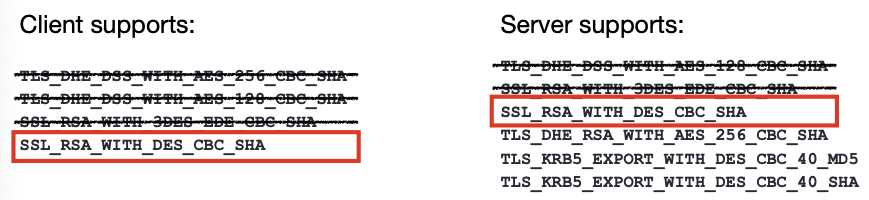

# 1. TLS

- How it works?
- Common problems

## 1.1 The SSL/TLS Protocol

- The Secure Sockets Layer (SSL) protocol was renamed to Transport Layer Security (TLS) protocol.
- It provides encrypted socket communication and authentication, based on public keys.
- It may use a range of ciphers (RSA, DES, DH, ...)

> <u>传输层安全协议</u>用于在两个通信应用程序之间提供保密性和数据完整性。
>
> **加密：**隐藏从第三方传输的数据。
>
> **身份验证：**确保交换信息的各方是他们所声称的身份。
>
> **完整性：**验证数据未被伪造或篡改。

## 1.2 X.509 Standard for Certificates (证书的标准)

- These certificates contains a subject, subject’s public key, issuer name, etc.

- The issuer signs the hash of all the data

- To check a certificate, I hash all the data and check the issuers public key.

  <u>这里要对所有数据进行哈希是为了做数字签名，然后别人就可以用公钥来验证。如果摘要值正确则可以确定是由颁发者的私钥生成的。</u>

- If I have the issuer's public key and trust the issuer, I can then be sure of the subject's public key.

> X.509 是用于标准格式的公钥证书，是将加密密钥对与网站，个人或组织等身份安全地关联的数字文档。

[What is X.509 Certificate?](https://www.ssl.com/faqs/what-is-an-x-509-certificate/)

## 1.3 The Internet Protocol Stack

### 1.3.1 Most of the Time

| Layer         | Protocol             |
| ------------- | -------------------- |
| Application   | Stuff that you write |
| Transport     | TCP or UDP           |
| Network       | IP                   |
| Link/Hardware | Ethernet or 802.11   |

### 1.3.2 With TLS

- The TLS layer runs between Application and Transport layer. <u>传输安全协议在应用层和传输层之间运行</u>
- The encryption is transparent to the Application layer.
- Normal TCP and IP protocols etc. can be used at the low layers.

> HTTPS是在 HTTP 协议基础上实施 TLS 加密，所有网站以及其他部分 web 服务都使用该协议。因此，任何使用 HTTPS 的网站都使用 TLS 加密。换句话说，HTTP + TLS = HTTPS。
>
> 可以将TLS层视作一个在应用层和传输层之间独立的安全层：它为应用层提供安全性和保护机制，同时利用传输层协议进行数据的可靠传输。

## 1.4 How TLS works

**Example**

1. C --> S: N_c 客户端发送Nonce至服务器
2. S --> C: N_s, Cert_s 服务器发送新Nonce和证书至客户端 让客户端查看
3. C --> S: E_s(K_seed), {Hash_1}_Kcs 客户端用证书中提到的方式加密Seed钥匙 并用创建的Kcs钥匙加密hash1
4. S --> C: {Hash2}_Kcs

Hash计算的方式为：前面的所有消息都被hash并被Kcs加密以保证完整性

- Hash1 = #(N_c, N_s, E_s(K_seed)) Hash1是两个Nonce和加密K种子的哈希值，用于验证消息是否被篡改过。
- Hash2 = #(N_c, N_s, E_s(K_seed), {Hash1}_Kcs) Hash2同理，但是再加上Hash1。

Kcs is a session key based on N_c, N_s, K_seed. 

## 1.5 TLS-DHE

A variant uses Diffie-Hellman for *forward secrecy* TLS配合DH来达成前向保密。

i.e. if someone gets the server's key later, they can't go back and break a recording of the traffic.

在下面例子中，由于g<sup>x</sup>和g<sup>y</sup>是随机的，所以就是知道私钥也没有办法求出g<sup>xy</sup>。由于计算Session key的其中一个参数缺失，因此无法得到Session Key，也就达成了前向保密。

1. C --> S: N_c 客户端发出Nonce
2. S --> C: N_s, g^x, Cert_s, Sign_s(#(N_c, N_s, g^x)) 对前面所有内容进行签名，证明自己是服务器并防止内容被篡改
3. C --> S: g^y, {#(All previous messages)}_Kcs 客户端发送g^y并通过得到的g^x来计算g^xy和session key
4. S --> C: {#(All previous messages)}_Kcs 同上。

Kcs is a session key based on N_c, N_s, g^(xy)

## 1.6 Cipher Suites 加密套件

Cipher Suites with encryption and authentication: 带加密和认证的

```
SSL_RSA_WITH_3DES_EDE_CBC_SHA
SSL_RSA_WITH_DES_CBC_SHA
SSL_RSA_WITH_RC4_128_MD5
SSL_RSA_WITH_RC4_128_SHA
TLS_DHE_DSS_WITH_AES_128_CBC_SHA
TLS_DHE_DSS_WITH_AES_256_CBC_SHA
TLS_DHE_RSA_WITH_AES_128_CBC_SHA
TLS_DHE_RSA_WITH_AES_256_CBC_SHA
TLS_KRB5_EXPORT_WITH_DES_CBC_40_MD5
TLS_KRB5_EXPORT_WITH_DES_CBC_40_SHA
...
```

Cipher suites with just authentication: 只带认证的

```
SSL_RSA_WITH_NULL_MD5
SSL_RSA_WITH_NULL_SHA
```

Cipher suites with just encryption: 只带加密的

```
SSL_DH_anon_EXPORT_WITH_DES40_CBC_SHA
SSL_DH_anon_EXPORT_WITH_RC4_40_MD5
SSL_DH_anon_WITH_3DES_EDE_CBC_SHA
SSL_DH_anon_WITH_DES_CBC_SHA
SSL_DH_anon_WITH_RC4_128_MD5
TLS_DH_anon_WITH_AES_128_CBC_SHA
TLS_DH_anon_WITH_AES_256_CBC_SHA
```

**In TLS 1.0-1.2**

**Algorithms supported in TLS 1.0-1.2 cipher suites**

| Key exchange/agreement | Authentication | Block/stream ciphers | Message authentication |
| ---------------------- | -------------- | -------------------- | ---------------------- |
| RSA                    | RSA            | RC4                  | Hash-based MD5         |
| Diffie-Hellman         | DSA            | Triple DES           | SHA hash function      |
| ECDH                   | ECDSA          | AES                  |                        |
| SRP                    |                | IDEA                 |                        |
| PSK                    |                | DES                  |                        |
|                        |                | Camellia             |                        |
|                        |                | ChaCha20             |                        |

## 1.7 Cipher Suites Handshake

**TLS 1.3 握手** 用于在客户端和服务器之间建立安全连接并进行加密通讯。


1. 客户端Hello：客户端向服务器发送<u>ClientHello消息</u>，<u>包含支持的TLS版本号、Cipher suites列表</u>和随机数等信息。
2. 服务器Hello：服务器向客户端发送<u>ServerHello消息</u>，<u>选择TLS版本、Cipher suite</u>和生成随机数。服务器还可能会发送服务器证书，用于身份验证。
3. 密钥交换：如果服务器要求客户端进行密钥交换，服务器会发送密钥交换消息，包含服务器的公钥或者临时密钥。客户端使用服务器的公钥或临时密钥来生成共享密钥。
4. 证书验证：如果服务器发送了证书，客户端会验证证书的有效性，包括检查证书的签名和有效期等。
5. 客户端密钥交换：客户端生成自己的密钥交换消息，包含客户端的公钥或临时密钥。
6. 完成消息：客户端发送Finished消息，其中包含握手消息的哈希值，用于验证握手过程的完整性。
7. 服务器完成：服务器也发送Finished消息，用于验证握手过程的完整性。

> 客户端在第一次握手时发送"Key Share"扩展。Key Share扩展包含了客户端生成的Diffie-Hellman公钥，用于密钥交换。这样，客户端和服务器可以基于这些公钥协商出一个共享的预主密钥，用于后续的密钥派生和加密通信的建立。

## 1.8 Weakness in TLS

Configuration weakness:

- Cipher downgrading 攻击者故意让系统使用老旧的，安全性差的工作方式，比如明文通讯。
- Self-signed certificates 自签名证书无需认证，因此用户应该在明确知道该凭证是属于对方时才信任。

Direct attack against implementations:

- Apple's goto fail bug
- LogJam attack
- HeartBleed

### 1.8.1 Cipher downgrading attack

Ciphers are listed in the order of preference.


优先查看Client supports的第一行，看Server support里有没有对应。如果没有，就看Client supports第二行，再Server supports里找对应。

但是这可以被降级：



这个情况下，被迫使用了一个低级的cipher suite。这些cipher suite messages是没有被认证的。

一个拥有该网络的攻击者可以移除强力的ciphers，如果客户端和服务器都支持一个更低级的cipher，那攻击者就可以强制使用它。

### 1.8.2 Self-signed certificates

- Maintaining a set of certificates is hard (especially on apps and IoT devices).
- It's much easier just to accept any certificate (or certificates that sign themselves).

The problem is: If the client accepts the self-signed certificates, then it's easy to man-in-the-middle.

> 因为难以维持一组认证，干脆什么认证都接受。这样就会导致中间人攻击。

### 1.8.3 Cipher suites

- 如果一方有较弱的 cipher suite 而另一方没有呢？
- 一般情况下，这是安全的。
- 浏览器开发人员移除所有弱的ciphers，只留下强力的在服务器里。
- 取决于不同cipher suite的不兼容情况。比如：
  - `SSL_RSA_WITH_DES_CBC_SHA`
  - `TLS_DHE_DSS_WITH_AES_256_CBC_SHA`

### 1.8.4 LogJam

- The Snowden leaks revealed that the NSA regularly MITMed TLS.
- Why? [https://weakdh.org/imperfect-forward-secrecy-ccs15.pdf](https://weakdh.org/imperfect-forward-secrecy-ccs15.pdf)
- A weak Diffie Hellman key is compatible with a strong Diffie Hellman key!

> [Logjam是个什么鬼？](https://www.aqniu.com/vendor/7758.html)

Logjam使用了Diffie Hellman的漏洞，如何做到的？

**原本的生成密钥的方式：**


通过一个很大的 prime number P, 来确保密钥K难以被破解。但是这可以被中间人攻击所降级，使P不够大，让破解的难度降低。


第一行，客户端告诉服务器能支持如下Cipher suites，其中包含`DHE`，一个有强力P的加密方式。中间人截获后，改成`DHE_EXPORT`，这个版本和`DHE`没什么不同，但P很弱。服务器根据要求发送了客户端需要的内容，客户端收到后并不知道自己使用了弱版本`DHE`，认为没有问题后发送了`g^a`, 但由于P很弱，密钥可以被暴力破解出来，中间人成功欺骗了客户端。

### 1.8.5 HeartBleed

A programming error in OpenSSL.


由于代码失误，服务器会返回其他在内存里的信息。有可能泄露主密码。

## 1.9 TLS 1.3

- Newest standard, ratified August 2018 最新标准

- Remove obsolete cryptographic protocols 移除旧版的加密协议

- Simplified handshake --> efficiency gain 简化握手

- Forward secrecy mandatory 强制正向加密

- Intercepting TLS connections now only possible as active attacker performing MITM attack 

  现在只有作为主动攻击者执行中间人攻击，才有可能拦截TLS连接。

# 2. Tor 洋葱路由

- Anonymity on the internet
- The Tor Protocol
- Hidden servers

## 2.1 Virtual Private Networks

- VPNs securely connect you to another network
- Secured with certificates and encryption, e.g., TLS or IPSec.

## 2.2 VPN for Anonymity

To get some anonymity, you can route all your traffic via the VPN.

- Server thinks you are the VPN provider 你访问的网站会将你识别为你所使用的VPN的提供方。
- ISP only sees the connection to the VPN 互联网服务提供商只能看到你和VPN的连接，这意味着你的网络活动对于ISP来说是不可见的，包括你访问的特定网站或使用的应用程序。
- A global observer can probably link your connections.

There is **no anonymity** to the VPN provider.

> ISP指互联网服务提供商Internet service provider。

___

What information does the **WiFi** provider have about you?

| Info                                                   | Yes or No |
| ------------------------------------------------------ | --------- |
| ...your WiFi's outgoing IP address                     | Yes       |
| ...that you are connected to the VPN                   | Yes       |
| ...your VPN's outgoing IP address                      | No        |
| ...that you are browsing to "https://bham.ac.uk"       | No        |
| ...the contents of your communication with the website | No        |

What information does the **VPN** provider have about you?

| Info                                                   | Yes or No |
| ------------------------------------------------------ | --------- |
| ...your WiFi's outgoing IP address                     | Yes       |
| ...that you are connected to the VPN                   | Yes       |
| ...your VPN's outgoing IP address                      | Yes       |
| ...that you are browsing to "https://bham.ac.uk"       | Yes       |
| ...the contents of your communication with the website | No        |

What information does the **Website** provider have about you?

| Info                                                   | Yes or No                                 |
| ------------------------------------------------------ | ----------------------------------------- |
| ...your WiFi's outgoing IP address                     | No                                        |
| ...that you are connected to the VPN                   | No (Might infer that from the IP address) |
| ...your VPN's outgoing IP address                      | Yes                                       |
| ...that you are browsing to "https://bham.ac.uk"       | Yes                                       |
| ...the contents of your communication with the website | Yes                                       |

## 2.3 Onion Routing

- You get the best anonymity by routing your traffic via a number of proxies.
- Onion Routing ensures that your message really is routed via the proxies you want.

> 洋葱路由是一种在网络上匿名沟通的技术，信息一层一层的加密包装成杨松一样的封包，並經由一系列被稱作洋蔥[路由器](https://zh.wikipedia.org/wiki/路由器)的網路節點傳送，每經過一個洋蔥路由器會將封包的最外層解密，直至目的地時將最後一層解密，目的地因而能獲得原始訊息。而因為透過這一系列的加密包裝，每一個網路節點（包含目的地）都只能知道上一個節點的位置，但無法知道整個傳送路徑以及原傳送者的位址。From wikipedia

## 2.4 Tor: Onion Routing

- 每个Proxy只知道它上一个Proxy的IP和下一个Proxy的IP，所以不知道整个路径。
- 每个Proxy的公钥是已知的。
- 第一个节点Node可见源IP，最后一个节点Node可见目的地IP。
- 用户选择三个Proxies (Entry, middle, exit nodes) 就可以匿名化，只要他们不全部 corrupt.

## 2.5 Hidden server

Tor hidden servers hide the server from you.

这些步骤描述了在 Tor 匿名网络中使用隐藏服务（hidden service）的过程，下面是对每个步骤的解释：

1. Bob选择一些引入点（introduction points）并与它们建立了一些 Tor **路径**（circuits）。

   **引入点**是连接隐藏服务和用户之间的中介节点。

2. Bob将他的隐藏服务（xyz.onion）在数据库中进行广告发布。这样，其他用户可以得知这个隐藏服务的存在。

3. Alice听说了 xyz.onion 的存在，并从数据库请求更多信息。

   她还设置了一个**会面点**（rendezvous point），尽管她也可以在此之前设置好。

4. Alice给Bob写一条消息（使用公钥加密），消息中包含了会面点和一个一次性密钥，然后请求一个引入点将消息交付给Bob。

5. Bob连接到Alice的会面点，并提供给她一次性密钥。

6. Bob和Alice随后可以像正常使用 Tor 路径一样进行通信，他们的通信将通过 Tor 网络进行匿名传输。

这些步骤允许隐藏服务提供者（Bob）和用户（Alice）在 Tor 网络上建立匿名的连接。隐藏服务通过使用引入点和会面点来隐藏服务器的真实位置，并使用公钥加密来保护通信的隐私。这样，用户可以匿名地访问隐藏服务，同时隐藏服务提供者的身份和位置得到保护。