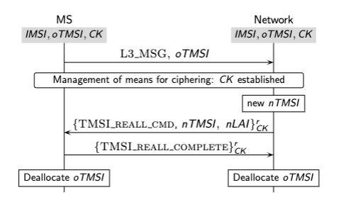
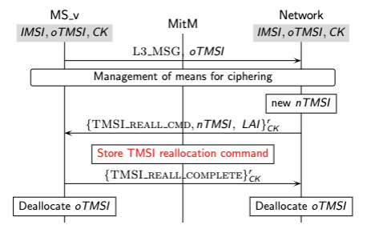
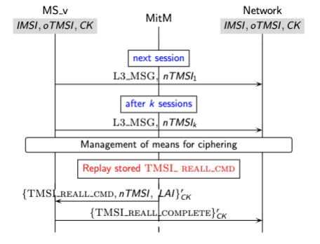
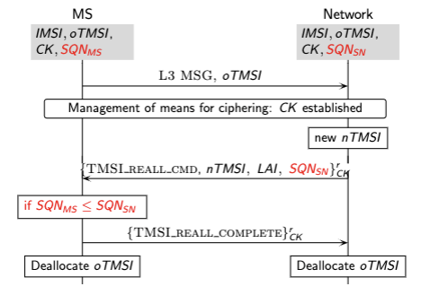
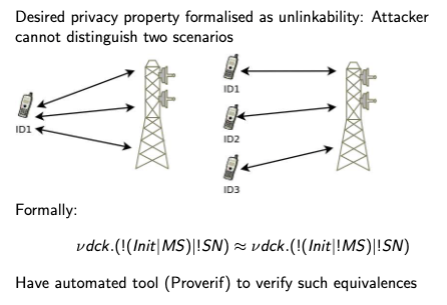

# 1. Protocol Verification

## 1.1 The Applied Pi Calculus

If we want formal language to model security protocols so that automatic verification can be done, then we use **Applied Pi-Calculus**, a suitable adaptation of process calculi.

Inituition: Process correspond to agents (Alice, Bob, Mallory, etc.)

Sending messages modelled as communication in process calculus.

Attacker modelled as arbitrary process which runs in parallel with process modelling Alice and Bob.

## 1.2 Proverif

Several tools available for automated verification, now consider **Proverif**.

- Reachability properties: Is a certain event reachable (e.g. leaking secret keys to the attacker)
- Correspondence assertions: If event e has been executed, then event e' has been previously been executed.
- Observational equivalences: The attacker cannot identify which one of two processes has been executed.

​		Examples:

​		Process 1: Voter A chooses option 1, voter B chooses option 2

​		Process 2: Voter A chooses option 2, voter B chooses option 1

> ProVerif 可以自动地分析和验证协议的安全性，它能够发现许多安全漏洞和攻击。它采用模型检查和漏洞搜索技术，能够检测到各种类型的攻击，如截获攻击、重放攻击、中间人攻击、身份伪造攻击等。同时，它还能够证明协议的正确性和保密性，确保协议满足特定的安全属性和约束条件。

# 2. Privacy in Mobile Telephony System

## 2.1 Mobile phone communication

- Mobile phones are carried by large parts of the population most of the time
- Wireless communication always on
- Emitting their identity
- Answer without agreement of their bearers

## 2.2 Mobile phone privacy

Privacy is explicit goal of UMTS standard:

UMTS specification: An intruder cannot deduce whether different services are delivered to the same user.

> 入侵者无法推断出是否向同一用户提供了不同的服务。

## 2.3 Tracking via mobile phones

- Example: Market research companies use signal strength to track customers.
- Anonymous, but linkable.
- No consent of mobile phone owner.

## 2.4 Mobile phone identifiers

- Every phone has a unique identifier (IMSI)
- If IMSI appears in cleartext, identification of mobile phone uesr would be easily possible
- Temporary identifiers (TMSI) used which should be changed periodically

## 2.5 TMSI reallocation

- Initiated by the MS to update its location
- MS unique identity stored in the SIM card, IMSI
- The network assigns a temporary identity TMSI
- A new TMSI is assigned during the location update

> TMSI是一种临时的用户标识，用于标识移动设备在通信网络中的位置和身份。当移动设备第一次接入通信网络时，它会被分配一个TMSI，并且TMSI与设备的真实身份（IMSI）进行映射。通过使用TMSI而不是IMSI，通信网络可以避免在无线传输中传递真实的用户身份信息，从而提高用户的隐私和安全性。
>
> 然而，由于移动设备可以在通信网络中频繁地切换位置和接入基站，因此TMSI需要定期进行更新和重新分配，以防止被攻击者利用来追踪用户的位置和身份。这就是TMSI reallocation技术的作用。它通过周期性地重新分配TMSI，以降低被攻击者跟踪和识别用户的可能性。当TMSI被重新分配时，通信网络会将新的TMSI与移动设备的IMSI进行映射，从而更新设备的临时标识。

**What problem might be?**

1. TMSI reallocation rurally executed: Experimentally verified

2. Old keys for encrypting traffic are reused after TMSI-reallocation

   Gives rise to protocol attack

Both issues make it possible to track mobile phone users.

## 2.6 Experimental Setup

- Osmocom-BB project implements GSM mobile station controlled by host
- Radio communication executed via flashed firmware on mobile phone
- Can use wireshark to analyse the communication

**Result**

TMSI reallocation procedure rarely executed: Same TMSI allocated for hours and even days.

Change of location area does not imply a chagne of TMSI.

## 2.7 TMSI reallocation protocol



**Replay Attack**





**Here is how to fix it**



## 2.8 Privacy properties of fix

Have formally specified and verified privacy properties of fix Applied Pi-calculus used for formalisation

- Agents modelled as processes 交流的个体 -> 进程
- Communication between agents modelled as messages on channels 交流 -> 通道里的信息
- have terms and reduction rules corresponding to cryptographic primitives
- nonces and private keys modelled by scope restriction of identifiers



## 2.9 Modelling TMSI

Issue: How to handle TMSI (stored in phone memory)?

- Instance of global mutable state
- Encoding of state in applied Pi-calculus leads to large amount of false positives in Proverif

Solution: add mutable global state as primitive

Leads to StatVerif

## 2.10 Conclusions

Temporary identifiers used by mobile phones are used incorrectly

- changed rarely
- old ciphering keys are reused

Weakness make it possible to track mobile phone users

Second problem can be fixed by not reusing keys

# 3. Web Technologies

## 3.1 Webserver 101

- Command to check open ports: `nmap localhost`

- Webserver on the VM is apache (very common)

  > Apache 是一个广泛使用的开源 Web 服务器软件。

- Database server on the VM is mysql (very common)

- Standard files in `var/www/html`

  ```
  cd /var/www/html
  ls -la
  ```

  > `/var/www/html` 是一个常见的目录路径，通常用于存放 Web 服务器（如 Apache）的默认文档根目录。在许多 Linux 系统中，特别是基于 Debian 或 Ubuntu 的系统，该目录用于存放 Web 服务器默认提供的网页文件。

- Have small demo website `http://vm-ics:demo/index.html`

## 3.2 PhP 101

- A web form is in page.html
- Will submit data to `add.php`
- `add.php` is a PhP script:
  - Mixed with html
  - Code between `<?php ?>`
  - C/Java-like syntax
  - `$_GET[]` to access GET variables
  - Similar for `$_POST[]`

**Example**

```html
<body>

	<?php
		// PHP代码开始
		$name = "John";
		$age = 30;
		echo "My name is " . $name . " and I am " . $age . " years old.";
		// PHP代码结束
	?>

</body>
```

> php是一种服务器端脚本语言，用于开发动态网页和Web应用程序。

## 3.3 Javascript 101

- Page using JavaScript to check some form fields:
  - `http://vm-ics:dome/pageJavascript.html`
- Checks fields client-side (not a good idea)

> JavaScript是一种脚本语言，主要用于网页前端的交互和动态效果。它运行在浏览器端，可以操作DOM（文档对象模型）和BOM（浏览器对象模型），实现动态修改页面内容、响应用户事件等功能。
>
> PHP则是一种服务器端脚本语言，用于处理动态网页生成和后台逻辑处理等任务。它运行在服务器端，可以与数据库交互、生成动态网页内容、处理表单提交等任务。
>
> 虽然PHP和JavaScript都可以在网页中嵌入代码来实现一些动态效果，但它们的定位和作用还是有一定区别的。

## 3.4 Databases 101

- pageJavascript.html POSTs to resultsPass.php
- Let's look into the DB:
  - sudo mysql
  - show databases;
  - show tables;
  - use web demo;
  - select * from users;

## 3.5 About basic web technologies

[Handout about basic web technologies](WebNotes.pdf)

[W3Schools.com PHP Tutorial](https://www.w3schools.com/php/default.asp)

[W3Schools.com SQL Tutorial](https://www.w3schools.com/sql/default.asp)