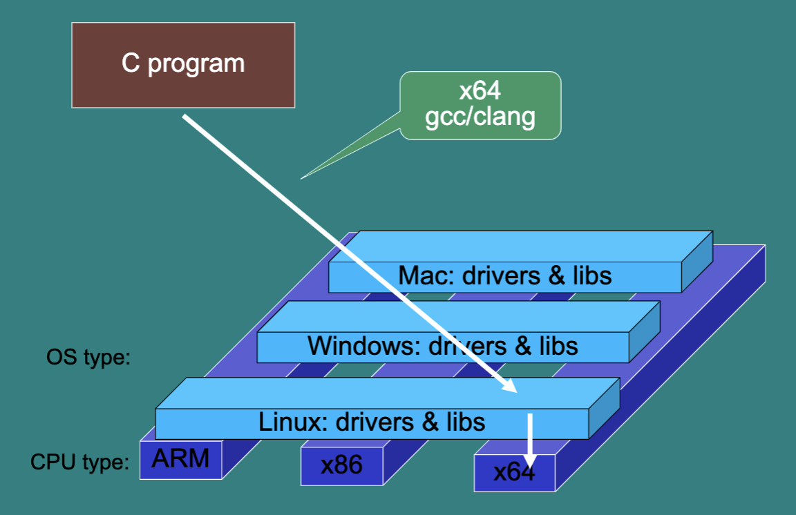
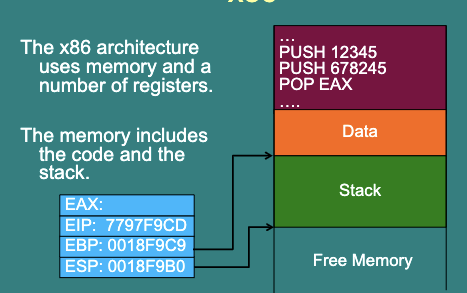

# 1. Binary analysis and application security

## 1.1 Data can be code

Lots of the attacks we have seen trick a program into accept data that is really code

- SQL Injection
- XSS
- Buffer overflow

Common way to attack systems.

## 1.2 Introduction

- Complied code is just data that can be edited and inspected.
- By examining low-level code, protection can be removed and function can be altered.
- Good protection tends to slow down this process, not stop it.

Outline

1. Java Byte Code
   - High level overview
   - Inspecting the byte code
   - Decompiling back to Java
2. x86 assembly
   - High level overview
   - Inspecting and altering binaries in Ghidra

## 1.3 Reasons for Reverse Engineering

- Analyse malmare
- Debug memory errors
- Analyse legacy code 分析旧代码
- Security audit 安全审计

## 1.4 Binaries

- Binaries are written in assembly 汇编语言
- Much lower level than Java byte code
- Assembly compiled for one type of machine won't run on another 编译完成的汇编语言无法在其他机器上运行
- But the same technique apply, even though a C program has to generate a different binary for each operating system that's running on.

> C program
>
> - Linux Binary: Linux OS
> - Window Binary: Window OS
> - Mac Binary: Mac OS
>
> 因此，为了实现跨平台性，通常会使用高级编程语言编写程序，然后通过编译器将其转换为汇编语言或机器语言，从而适应不同的计算机架构。而对于一些需要直接访问计算机硬件的系统程序，如操作系统内核和驱动程序等，仍然需要使用汇编语言来编写。



> X64: X表示任意操作系统，64指寄存器宽度为64位，可以一次性处理64位的数据。
>
> X86: 在X86架构下，CPU寄存器宽度为32位。
>
> gcc/clang: 两种常见的编译器，用于将高级编程语言（如C、C++等）的代码编译成汇编语言或机器语言，以便在计算机上运行。

## 1.4 IDA Pro and Ghidra

- IDA pro is an Interactive DisAssembler. 
- It helps human understand binaries.
- This is the standard tool for malware binary analysis, security analysis of firmware and reverse engineering.
- NSA released Ghidra - very powerful as well. 美国国安局发布的开源工具，官网可下载。

## 1.5 Some x86 Commands

```
PUSH - add to top of stack
POP - read and remove from top of stack
CALL - execute a function
JMP - jump to some code (like writing to EIP)
RET, RETN, RETF - end a function and restart calling code
MOV - move values between registers (MOV r1, r2 = PUSH r2 POP r1)
```

## 1.6 x86

- The x86 architecture uses memory and a number of registers.
- The memory include code and the stack



> EAX、EIP、EBP和ESP都是x86架构中CPU寄存器的名称，它们在计算机的运行中发挥着不同的作用。

## 1.7 Common pattern 1

Data is moved to register, operation is called, result stored in memory or register.

```x86
mov eax, [esp+1Ch]
add [esp+18h], eax
```

- Value at `[esp+1Ch]` is moved to register eax,
- It is added to the value at `[esp+18h]`
- The result is stored at `[esp+18h]`

## 1.8 Flags

After an arithmetic operation flags are set

- `ZF`: Zero flag
  - Set to 1 if result is 0
- `SF`: Sign flag
  - Set to 1 if result is negative
- `OF`: Overflow flag
  - Set to 1 if operation overflowed

> 这些标志位存在的主要目的是为了帮助处理器和程序员判断不同运算的结果，从而进行条件分支和异常处理等操作。这些标志位的正确理解和使用对于处理器的程序员以及反汇编器、调试器等工具的使用都非常重要。

## 1.9 Compare and Test

Compare and tests will set these flags, with no other effect.

- `CMP a b`
  - calculate a-b then sets flags
- `TEST a b`
  - Does a bit wise "a AND b": a /\ b then sets flags

## 1.10 Jump Commands

- Jump if equal, Jump if zero
  - `JE`,`JZ` address
  - Jumps to address if ZF = 1
- Jump if not equal, Jump if not zero
  - `JNE`,`JNZ` address
  - Jumps to address if ZF =/= 0
- Jump if less than
  - `JL` address
  - Jump to address if SP = 1 and OF =/= 1

> JUMP commands 是 x86 指令集中的跳转指令，用于控制程序的执行流程。通过 JUMP commands，程序可以根据条件跳转到指定的地址执行相关指令，从而实现程序流程的控制。

## 1.11 Common pattern 2

Data is compared using `CMP` or `TEST` then a jump is made based on the result.

```
cmp dword ptr [esp+1Ch], 3
jle short loc_80483DF
```

- Value `[esp+1Ch] - 3` is calculated (not stored)
- If it is less than or equal to zero, the program jumps to location `loc_80483DF`

- Otherwise it continues to the next command

## 1.12 Common pattern 3 (?)

- Data is loaded onto the stack
- Function is called that uses these values,
- The result will be pointed to by `eax`

```
mov [esp+4], eax ; s2
mov dword ptr [esp], offset s1 ; "exit"
call _strncmp
```

- Value in `eax` is moved to `[esp+4]`
- `"exit"` is put on top of the stack
- String compare is called on these.
- The result will be returned in the `eax` register

> - 第一行：将eax中的值存储到地址为esp+4的内存中，即将eax的值作为s2字符串的指针。
> - 第二行：将s1字符串的地址存储到esp地址指向的内存中，即将s1的地址作为_strncmp函数的第一个参数。
> - 第三行：调用_strncmp函数进行字符串比较，该函数的返回值存储在eax中。

## 1.13 Common Techniques (?)

- Look for strings
- Identify key tests and check the values in the register using a debugger
- Swap `JEQ` and `JNEQ` etc.
- Jump over the instructions that perform checks (replace with NOP)

## 1.14 Defense (?)

- Dynamically construct the code

  - Attacker can run code

- Encrypt the binary

  - Your program must include the key in plain text, so the attacker can find it

- Obfuscate the code, e.g. mix data and code, so it's not clear which is which

  - Can slow down attacks by months or years (e.g. Skype)

  > Obfuscation tool（模糊工具）是一种用于对软件或代码进行混淆的工具。它可以改变代码的结构和形式，使其难以被逆向工程或破解。这种工具通常用于保护软件的知识产权，防止黑客攻击，或者用于反软件破解。Obfuscation tool可以改变代码的变量名、函数名、跳转语句等等，使得代码难以被理解和修改。

- Require online activation

  - activation can be completely disabled, users don't like this.

- Require online content, e.g. WoW, BlueRay

- Require a hardware dongle of some sort

- Hardware-based protection, i.e. store and run part of the code in tamper-resistant hardware

## 1.15 Summary

- Machine code can be inspected and edited.
- Many tools exist to inspect, debug and decompile code.
- Most software protection can be removed.
- But slowing this down by months or years can save a business.

## A question

Which of the following statements about reverse engineering is true?

Recap of most important terms:
**Disassembler:** transforming binary code into human readable assembly instructions
**Decompiler:** transforming binary code binary code into a higher-level language

❌A disassembler is converting a binary file into hexadecimal codes.

> No, as the definition says, a disassembler converts a binary file into human readable assembly instructions (which depend on the CPU's architecture).

✅The decompilation process might fail sometimes.

> Yes, the decompilation can fail. This can happen for many reasons. For example:
>
> - Obfuscation techniques are used to prevent decompilation.
> - The decompiler tries to generate code in a programming language other than the original source.
> - Aggressive compiler optimisations.

✅Modern CPUs have registers and the binary machine code makes use of them.

> Yes, in contrast to higher-level programming languages, machine and assembly code often works with registers and accesses the memory directly.

❌Both disassembler and decompiler can identify all strings in a binary.

> No, again, there are obfuscation techniques that can prevent those tools from correctly identifying all strings.