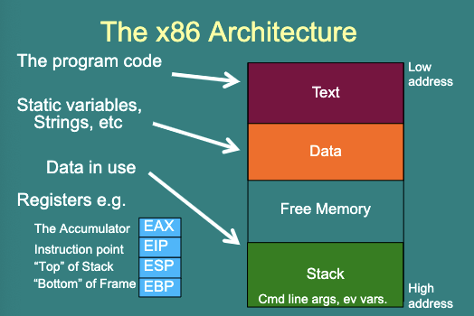
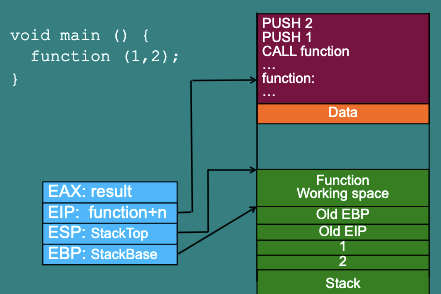

# 1. Buffer Overflow Attacks

A simplified high-level view of buffer overflow attacks.

- X86 architecture
- overflows on the stack
- Focus on 32-bit mode, but most things directly apply to 64-bit mode as well。
  - <u>因为在 32 位模式下，地址空间较小，栈和堆等内存区域通常会更密集地放置，因此攻击者更容易定位和覆盖关键内存位置。</u>
- In language like C, you have to tell the compiler how to manage the memory.
  - If you get it wrong, then an attacker can usually exploit this bug to make your application run arbitrary code.
  - Countless worms, attacks against SQL servers, web servers, iPhone jailbreaks, SSH servers, ...

**Example: what's wrong with this code?**

```c
void getname() {
  char buffer[32];
  gets(buffer);
  printf("Your name is %s.\n", buffer);
}
int main(void) {
  printf("Enter your name:" );
  getname();
  return 0;
}
```

`gets` doesn't check the length of input.

**Solution**

```c
void getname() {
  char buffer[32];
  fgets(buffer, sizeof(buffer), stdin); // fgets can prevents buffer overflow
  printf("Your name is %s.\n", buffer);
}

int main(void) {
  printf("Enter your name: ");
  getname();
  return 0;
}
```

`fgets()` is safer, it checks the length of input.

> `fgets()` 函数是一种更安全的获取用户输入的方法，因为它可以指定最大输入长度，并在读取输入时确保不会超过该长度。

## 1.1 The x86 Architecture



**EAX** 累加器：寄存器，用于暂存运算结果。

**EIP** 指令指针：存储着下一条将要被执行的指令的地址。

**ESP** 扩展栈指针：用于指向当前栈顶的位置。

**EBP** 扩展基指针：用于指向当前函数的栈帧(Stack frame)的基址(Base address)。

> 栈帧(Stack frame)是在函数调用时建立的一段连续内存空间，用于保存函数执行过程中需要保存的局部变量、参数、返回地址等信息。基址（Base Address）指的是内存区域的起始地址。

## 1.2 The Stack

The stack part of the memory is mostly "Last In, First Out".

**Example**

Text: ... `PUSH 12345` `PUSH 678245` `POP EAX` ...

Registers: `EAX: ` `EIP: 7797F9CF` `ESP: BF914EAC` `EBP: BF914ED8`

We can write and read to the top of the stack.

1. First line execute `PUSH 12345`: Now `12345` at the top of the stack, `EIP` goes to `7797F9CF` (original + 1), `ESP` goes to `BF914EAC` (b/c stack goes up).
2. Second line execute `PUSH 678245`: Now `678245` at the top of the stack, `EIP` goes to `7797F9D3`, `ESP` goes to `BF914EA9`.
3. Third line execute `POP EAX`: `EAX` stores `678245`, `EIP` goes to `7797F9D3`, `ESP` goes back to `BF914EAC`.

> 简而言之，`EIP`为指令指针，地址位置持续变高。`ESP` 为栈顶指针，当`PUSH`被执行，`ESP`地址变低，`POP`时`ESP`地址变高。

## 1.3 Function calls (32-bit)

```c
void main () {
  function (1, 2);
}
```

**Stack looks like this:**

PUSH <2>

PUSH <1>

CALL \<function\>

> Argument 1 & 2 are passed on the stack.
>
> The `CALL` instruction puts the address of `function` into `EIP` and stores the old `EIP` on the stack.
>
> 在 x86 架构中，函数调用时，参数是从右往左依次入栈的（先右侧参数，再左侧参数）。因此，在这个程序中，应该先将参数 2 入栈，再将参数 1 入栈，最后调用函数。

**Another example**



> 这个例子被简化了，情况如下：从`PUSH 2` 开始一行行向下执行，Stack一路堆高，当指针进入下一个函数时，`EBP`指向新的低位地址，并且把旧的`EBP`地址存进去。这样的话，就可以从上到下，一层一层`POP`变量，遇到`EBP`时就知道该函数已结束，要回到上一函数。

## 1.4 Buffer Overflows

- The instruction pointer controls which code executes,
- The instruction pointer is stored on the stack,
- Then, I can write to the stack. 

> 由于`EIP`会被储存在Stack里，因此可以根据其位置直接修改stack。

**Example 1**

```c
...
getname();
...
getname() {
  char buffer[16];
  gets(buffer);
}
```

1. When the function is called, `EIP` and `EBP` written to stack.

   Stack looks like this: `Old EBP`, `Old EIP`, `Stack` 正如上面所说，当新函数被调用，`EBP`会指向上级（旧函数）的位置。

2. When the function runs, buffer is allocated because of `char buffer[16]`.

   Stack looks like this: `16 byte length`, `Old EBP`, `Old EIP`, `Stack` 此处分配内存。

3. Now if user inputs `"HelloWorld"`

   Stack looks like this: `HelloWorld`, `Old EBP`, `Old EIP`, `Stack`.

4. What if user inputs is larger than 16 bytes? `"Hello World XXXXXXXXXXXX"`

   Well, add `Old EIP` and `Old EBP` into the stack as before, but the string flows over the end of the buffer, `EIP` corrupted, segmentation fault thrown. 本来要储存旧EBP和旧EIP的位置全变成了`XXXX`。

   Stack looks like this: `Hello World XXXXXXXXXXXX`, `XXXX`, `XXXX`, `Stack`.

**Example 2: with malice**

1. Runs as before

2. Attacker send a verlong message, ending with the address of some code that gives him a shell:

   `Hello World XXXX XXXX97F9`

   Stack looks like this: `Hello World XXXX`, `XXXX`, `97F9`, `Stack`. 通过恶意输入，来修改`Old EIP`的位置，并以此修改接下来要执行的函数。

3. When the function returns the attacks code (here: at `0x97f9`) is run.

   当旧`EIP`的函数被执行结束（可能是获取高级权限），攻击者插入的恶意代码就会被执行。
   Stack looks like this: `Hello World <malicious code>`, `XXXXXX`, `7797F9`, `Stack`.

## 1.5 What to inject?

Now we know buffer overflow can inject code, but what would attacker injects?

Shell code (under Linux) is assembly code for:

```shell
exec("/bin/sh", {NULL}, NULL)
```

There are some defenses in modern Linux, hence use that to indirectly call a binary that first `setuid(0)` and then spawns a shell.

> 上面这行代码，会在受害者的系统上执行shell命令。这行代码是一个调用`exec`系统调用的代码，具体来说，它会执行`/bin/sh`这个shell程序（这是系统默认shell程序），可以用于执行命令行指令。`exec`系统调用会用制定的程序替换掉当前进程的内存映像，从而运行指定的程序。在这个过程中，第二个参数为`NULL`, 表示使用默认的环境变量，第三个参数为`NULL`, 表示不需要传递任何命令行参数。

## 1.6 Defense: The NX-bit

The attacks above injects malicious code into the Stack of memory.

- Code should be in the text area of the memory. Not on the stack.
- The NX-bit provides a hardware distinction between text and stack.
- When enabled, the program will crash if the `EIP` ever points to the stack.

> NX-bit是一种硬件技术，也称为不可执行（No eXecute）或可执行禁止（eXecute Disable），主要用于防止内存执行攻击，其中包括缓冲区溢出攻击。
>
> 换句话说，NX-bit提供了一种硬件机制，用于区分代码段和栈区域。当开启NX-bit时，如果程序尝试将EIP指向栈区域，程序将会崩溃。这有助于防止恶意攻击者利用缓冲区溢出漏洞注入恶意代码并执行攻击。

## 1.7 Reuse Code

> 针对NX-bit的一些常用攻击手段：复用代码

The standard attack against the NX-bit is to reuse code from the executeable part of memory. E.g.

- Jump to another function in the program.
- Jump to a function from the standard C library (Return to libc)
- String togethre little pieces of existing code (Return-oriented programming).

### 1.7.1 Return-to-libc

- Libc is the C standard library.
- It is often packaged with executables to provide a runtime environment.
- It includes lots of useful calls like "system" which runs any command.
- It links to executable memory, therefore bypasses NX-bit protections.

> 简而言之，Return-to-libc 利用了在程序的动态链接库中存在的许多可执行的函数，如libc中的函数，而不是在栈上注入恶意代码。通过覆盖`EIP`来强制程序跳转到<u>已知的libc函数地址</u>，并且通过调用这些函数实现攻击。这种攻击方式避免了将代码注入到栈中，因此可以绕过 NX-bit 的保护机制。
>
> 这些已知的libc函数往往包含很多像”system“这样的命令，非常有效。

## 1.8 Address space layout randomization

- ASLR adds a random offset to the stack and code base each time the program runs.

- Jumps in the program are altered to point to the right line.

- The idea is that its now hard for an attacker to guess the address of where they inject code or the address of particular functions.

  <u>这个方法的基本原理是将栈堆和代码段增加一点随机性，让攻击者不知道代码插入到了哪里或找不到某一个库中已经存在的函数来调用</u>

- 对于Linux系统，可以通过命令`sysctl -w kernel.randomize_va_space=X` 来调整ASLR的设置。其中，`X`的取值如下：
  - 0：关闭ASLR
  - 1：对栈和共享库启用ASLR
  - 2：对栈、共享库、和数据段都启用ASLR

## 1.9 NOP slide

- In x86 the op code assembly instruction `0x90` does nothing.

  <u>操作码汇编指令 `0x90` 是 `NOP`（No Operation）指令，表示不执行任何操作，相当于一条空指令。因此，这句话的意思是 `0x90` 不会对程序的执行产生任何影响。</u>

- If the stack is 2MB, I could inject 999000 bytes of `0x90` followed by my shell code.

  使用容量为999000 bytes的`0x90`来占据2MB中前面的空间，最后一点空间执行shell code。

- I then guess a return address and hope it is somewhere in the 2MB of NOPs.

- If it is, the program slides down the NOPs to my shell code.

- Often used with other methods of guessing the randomness.

> 当程序执行到缓冲区中的NOP指令时，它将继续执行下一条指令。由于攻击者无法精确控制程序跳转的位置，因此NOP指令的数量通常非常大，以确保攻击者的代码在NOP指令序列中任何位置都能被执行。这就是所谓的NOP slide。攻击者可以使用NOP slide来定位恶意代码的起始位置，以便在程序执行期间跳转到该位置并执行恶意代码。

## 1.10 Metasploit 开源的漏洞利用工具集

- Metasploit is a framework for testing and executing known buffer overflow attacks.

- If a vulnerability in an application is well known their will be a patch for it, but also a Metasploit module for it.
- If an appliaction is unpatched it can probably be taken over with Metasploit.
- Metasploit also includes a library of shell code which can be injected.

## 1.11 Conclusion

- Buffer overflows are the result of poor memory management in languages like C, even the "best" programmers will make mistakes.
- Buffer overflow attacks exploit these to overwrite memory values.
- This lets an attack execute arbitrary code.

> 加强内存管理。

---

- Command to compile code without some of the protections: `gcc -z execstack -fno-stack-protector -g <your c file> -o <output binary> -O0`