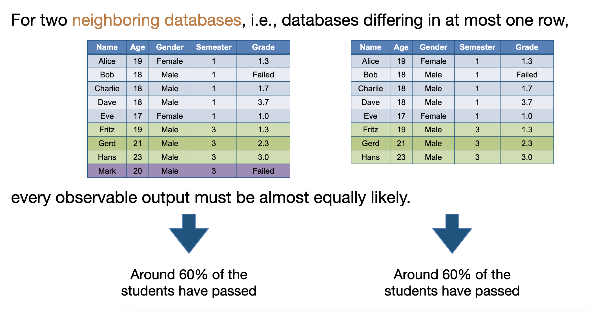

# 1. Database Privacy

- Motivation
- Data sanitisation
- K-anonymity and L-diversity
- Differential Privacy

---

**Motivation? 为什么要学数据隐私？**

For example, we have a medical record database. It contains names, birthdates, gender, ZIP, diagnosis, medication and more. Data is useful for researchers to gain new insights, train ML model, etc. But, do we want it to be publicly available?

---

**Intuitive definition**

- Data privacy studies computational solutions for releasing data, such that
  - the data is practically useful (utility),
  - aspects of the subject of data are not revealed (privacy). 数据主体的某些方面不会被泄露。

> 数据的实用性和它的隐私性是相互制衡的，如果数据要达到完全的实用性，那就要完全牺牲隐私性。反之，要完全的隐私性，那就会牺牲实用性。

## 1.1 Anonymity vs. Privacy

- Anonymity 匿名性
  - The state of **not being identifiable** within a set of subjects/individuals. <u>在一组主体或个体中无法被识别的状态。</u>
  - It is a property exclusively of individuals. 个人独有的财产
- Privacy 隐私
  - Privacy is the claim of individuals, groups, or institutions to **determine** for themselves **when, how and to what extent information** about them is communicated to others. <u>隐私是个人、团体或机构自行决定何时、如何以及在何种程度上将有关他们的信息传达给他人的主张。</u>

- Anonymity != Privacy
  - Anonymity is a way to maintain privacy, and sometimes it is not necessary.

## 1.2 Attribute disclosure 属性泄露

在处理个人数据时，泄露出数据中包含的某些个人特征或属性，从而使攻击者能够识别出数据主体的身份。例如，一个匿名的调查问卷，如果在回答中包含了一些具有唯一标识的敏感信息，比如生日、家庭住址、邮政编码等，攻击者就可能通过这些属性信息，推断出调查的具体参与者身份。

## 1.3 Cryptographic solutions

Why can't we encrypt?

- Strong or transmitting data encrypted is a good idea.
- Someone needs to have key.
- Often, data is outsourced (into the cloud) for processing.

> 通常情况下，数据会被外部机构或服务提供商（例如云服务提供商）所处理。这些外部机构或服务提供商可以通过使用加密技术，保护客户数据的安全和隐私。

# 2. Data Sanitization

- Legally, data has to be "sanitized" 数据清洗
- Removal of "identifying" information 去除敏感信息

> 比如，一份未清洗的数据会包含Name, Gender, Age, Address, Phone Number。 清洗过后就会只剩下Gender和Age.

## 2.1 Sanitization / De-Identification

Is sanitization enough?

If only the name is removed, information can still be matched by birthdate. **e.g. Match clinical records with public info.**

>  Re-identification 或 linking attack 是针对个人隐私的攻击方式，它通过对已匿名化的数据进行重新识别或关联，从而揭示个人身份信息和敏感数据。具体来说，Re-identification攻击通常是利用外部数据源和统计分析技术，将匿名数据与其他公开数据集、社交网络、电子邮件等数据源进行关联，从而揭示出个人身份信息和敏感数据。

# 3. K-anonymity and L-diversity

## 3.1 Attacks on Databases

Early defense mechanism: query sanitization

> Query sanitization(查询清洗)是一种针对数据库攻击的防御机制，它通过对用户输入的查询请求进行过滤和清洗，从而防止恶意查询或注入攻击，确保数据库的安全和完整性。

**Sanitization**

1. Queries must not depend on identifiers. 查询应该尽可能避免依赖于标识符。
2. Queries must not be answered if the answer uses less than a threshold of rows. 当查询结果少于某个阈值就不要回答，这么做是为了避免敏感信息的泄露。比如某成绩单表格，查询分数低于40的同学，如果实际结果只有两个的话，那就不要回答，因为攻击者可以通过其他公开信息锁定具体目标。

## 3.2 K-anonymity

Privacy means that one can hide within a set of (at least) K other people with the same **quasi-identifiers**.

**Quasi-identifiers**: Attributes that could identify a person (name, age, etc.) 可以通过某些属性来识别唯一的一个人或一项数据，这些属性被称为quasi-identifiers.

> K匿名是一种隐私保护技术，旨在防止数据集中的个人身份信息被泄露。在K匿名模型中，对于数据集中的每个记录，都需要将其与至少K-1个其他记录进行合并，以使得在该记录的属性集合中，<u>任何子集在数据集中至少有K个记录与之匹配</u>。这样可以确保对于任何一个记录，都至少有K个记录与其属性相同，从而提高数据隐私保护的安全性。
>
> Quasi-identifier是一个重要概念，它是指一组属性，在数据集中可以<u>被用于将记录进行区分的属性集合</u>。例如，假设一个数据集包含姓名、出生日期、性别、邮编等属性，其中姓名和出生日期组合起来可以唯一地确定一个人。在这种情况下，姓名和出生日期就是一个quasi-identifier，需要进行匿名化处理以保护数据隐私。

## 3.3 Achieving K-Anonymity

Reduce the information such that the data collapse.
**Suppression**: remove some data if it can't achieving K-anonymity.

> 在K-anonymity中，当数据集中的某些记录无法达到K匿名的要求时，可以采用suppression（抑制）来保护数据隐私。Suppression指的是删除数据集中某些属性或记录以保护数据隐私的一种方法。
>
> 例如，假设一个数据集包含姓名、年龄、性别、身份证号等属性，其中身份证号是唯一标识一个人的属性，但是不能出现在匿名化后的数据集中。在这种情况下，可以采用suppression方法删除身份证号属性或者整个记录，以保护数据隐私。

**Generalization**: Turn specific value into a range, e.g. turn city into province.

> 泛化，通过泛化处理可以使得数据集中的属性值变得更加抽象和模糊，从而降低敏感信息的泄露风险。
>
> 比如把深圳泛化为广东，把21岁泛化为20-25岁。
>
> 泛化的程度也会影响到数据的可用性和准确性，需要在数据隐私保护和数据质量之间进行平衡。

## 3.4 Attacks on K-Anonymity: homogeneity

One may learn a lot of information about an individual, if there are k people with this information.

> 举个例子：在k=5时，某学校第三学期的五个学生全都不及格。那么攻击者在知道目标学生是第三学期的话，他就会知道目标学生不及格。

## 3.5 Attacks on K-Anonymity: Background Knowledge

Background knowledge that might look unsuspicious or not too privacy critical may lead to privacy breaches. <u>看起来不可疑或隐私不太重要的背景知识可能会导致隐私泄露。</u>

> 延续上面的例子，第三学期现在有三人及格，两人不及格，那么第三学期的Bob看起来不太开心就能大概率判断出他可能没及格。

## 3.6 L-diversity

**Intuition and definition**: There have to be L different, "representative" result for each set of quasi-identifiers.

> 比如，同为第三学期的五个学生，成绩分别为不同的：1.0, 2.3, 3.7, Failed, 3.0

**Properties**

- Homogeneity attacks are impossible (enough representative values)
- Many knowledge based attacks can be covered
- They often do not lead to direct deanonymization,
- But only quantitatively reduce the diversity.

## 3.7 Attacks on L-diversity: lots of knowledge

An example of L = 5.

Assume you are in 3rd semester, have a 2.3, your friend John has a 3.0, and you know that Alex just barely passed the exam. Moreover, Bob, who is also in 3rd semester, looked unhappy after the exam, so it is very unlikely that he achieved the 1.0, and consequently it is very likely that he failed the exam.

> 简单来说，就是了解的信息实在太多了，能在真实世界中排除错误的可能性。

# 4. Differential Privacy 差分隐私

> Differential privacy（差分隐私）是一种用于数据隐私保护的技术，其目的是在保护数据隐私的同时允许对数据进行高效的分析和处理。差分隐私技术可以防止针对数据集中的个人信息进行隐私攻击，同时保持对数据集的有限使用。
>
> 差分隐私的基本思想是在查询结果中加入一定量的噪音，以混淆查询结果中的个体信息，从而达到保护数据隐私的目的。

## 4.1 Case: Netflix Prize

- Time: 2007-2009

- Challenge: "Find a better recommendation algorithm"

- Reward: 1,000,000 USD

- Data: Training set (about 100,000,000 ratings from about 480,000 users)

  | User  | Movie                     | Rating | Date      |
  | ----- | ------------------------- | ------ | --------- |
  | Alice | Piratest of the Caribbean | 3      | 04-Nov-15 |

To prevent certain inferences being drawn about the Netflix customer base, some of the rating data for some customers in the training and qualifying sets have been **deliberately perturbed** in one or more of the following ways: deleting ratings; inserting alternative ratings and dates; and modifying rating dates.

> 简而言之，Netflix在处理和发布数据时为了保护用户隐私而采取了一些数据扰动技术。具体来说，Netflix删除了一些用户的评分数据、插入了一些虚假的评分数据和评分日期，或者修改了一些评分的日期，以降低数据对用户隐私的敏感性。

## 4.2 Netflix Prize - Anonymization and Deanonymization

匿名化与去匿名化

**Claim**: "To protect customer privacy, **all personal information** identifying individual customers **has been removed**, and all customer ids have been replaced by randomly assigned ids."

## 4.3 Differential Privacy

- Problem: Existing approaches can be circumvented; specific sanitization (remove information) without guarantees.
- Goal: Provide provably private sanitization

## 4.4 Randomised Response

- Proposed by S. L. Warner in 1965 as an interview strategy for sensitive questions.
- Question: "Did you drink more than 2 liter alcohol this week?"
- You toss a coin.
  - Heads: Answer truthfully.
  - Tails: Answer opposite of truth.
- You can always claim you answered the opposite.

> 回答者无法确定实际上是哪种回答被提交给了调查者，因为在随机化的过沉重，回答被添加了噪音。回答者不知道硬币的结果，也不知道实际上提交给调查者的是真实的回答还是虚假的回答。而提问者只能得到回答的统计结果，比如喝了的占30%，没喝的占70%。

- Proportion of Yes response: Y = p * RY + (1 - p) * (1-RY), where RY is the proportion of true yes response.
- Proportion of true yes responses: RY = (Y+p-1) / (2p-1)
- Statistical guarantee of being private, while analysis is still possible!

> 例如，如果Y=3，p=0.5，那么RY的计算为：RY = (3+0.5-1)/(2*0.5-1) = 0.6
>
> 这表示加入噪声后，真实回答为true的比例为60%。

---

**Intuition**: A mechanism is differentially private, if the output does not observably depend on whether you are in the database or not.

>  这个定义保证了个体数据的隐私性，因为<u>即使攻击者拥有所有其他个体数据的信息，也不能确定某个具体的个体数据是否存在于数据集中</u>。同时，它也保证了机制的有用性，因为输出结果仍然具有一定的统计意义和可用性。

> 具体来说，对于一个差分隐私的机制，它应该满足对于任意两个数据集 D1 和 D2，只要 D1 和 D2 仅在一个个体数据上不同，那么机制的输出结果应该是相同的或者非常相似的。也就是说，对于任何一个可能的输出结果，攻击者都不能判断出这个结果来自哪个具体的个体数据，因为机制的输出不明显地依赖于这个具体的个体数据是否存在于数据集中。
>
> <u>上面的例子就是，虽然去掉了一个数据，但是输出的结果依然是约60%的学生及格了。</u>

## 4.5 Differential Privacy - How (not) to achieve it

**Generalization**: Circumstances and sufficient knowledge breaks generalization.

In previous example: originally we have 7 students have passed, 2 have failed, but now only 1 has failed. An attacker may observe the difference.

With sufficient knowledge (in the extreme case: about all other students), it may learn whether Isa participated or not.

## 4.6 Achieving Differential Privacy

Addition of random noise: we randomly modify the result <u>整点噪音</u>

True answer: **170** students have passed **82** have failed

<u>Add Noise: -2.3 students have passed, +1.4 students have failed.</u>

Noise answer: **167.7** students have passed, **83.4** have failed

Note that the noise does not preserve "sanity checks" such as: <u>(没法保持合理性检查)</u>

- The total number of students is preserved <u>学生总数应当保持不变</u>
- The result is always a natural number >= 0 <u>始终是个自然数</u>
- If within the noisy answer the exam has to be repeated (because too many people failed), then the same holds for the previse result. (such a mismatch can leak information) <u>如果噪声结果表明考试需要重复（因为太多人不及格），那么精确结果也应该如此。如果存在这种不匹配，可能会泄露信息。</u>

---

Differential privacy can cope with arbitrary adversarial knowledge

- The adversary may know the whole database, except for one entry

Rules of thumb:

- The more precise the answer is (less noise), the more privacy is lost.
- For a small database: **good privacy** means **lots of noise** means **bad utility**

## 4.7 Post-processing and Differential Privacy

> 在隐私保护中，post-processing指在应用了隐私保护机制后，对输出进行进一步处理或分析的过程。这个过程可能会使得先前应用的隐私保护机制失效

Post-Processing (deterministic and probabilistic) is possible:

As long as it depends on the noisy output (not on the original dataset), every computattion is possible and does not decrease privacy.

> 比如之前的167.7 students have passed, 83.4 have failed 会被主观计算（四舍五入rounding，上下界bounding, ...）来得到更合理的数据：168 students have passed, 83 have failed.

## 4.8 Privacy-friendly Aggregation (Smart Metering)

Goal: Privacy guarantees for aggregated data: It should be impossible to infer the energy consumption of any individual household. <u>其目标是在对电表数据进行聚合时提供隐私保障，确保不可能推断出任何单个家庭的能源消耗。</u>

Challenges: Sanitization of dynamic data (streaming), decentralised noising, learning with differential privacy.